# Task 01: Connect to an MCP server

### Introduction

Copilot Studio includes connectors for many MCP servers. You can also connect to other MCP servers.

### Description

In this task, you'll connect to the Microsoft Learn documentation MCP server.

### Success criteria

- You've connected to the MCP server.
- When prompted, the agent responds with information and links to Microsoft Learn documentation.


### Key tasks

### 01: Add tools and resources from an MCP server to the agent

1. On the command bar for the agent, select **Tools**.

	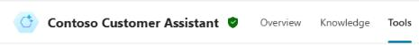

1. Select **+ Add a tool**. 

	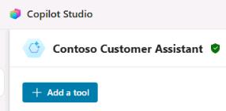

1. In the **Add tool** dialog, select **Model Context Protocol**.

	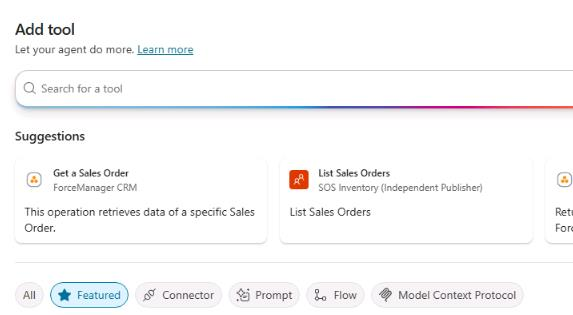

1. In the list of available MCP connectors, select **Microsoft Learn Docs MCP Server**.

	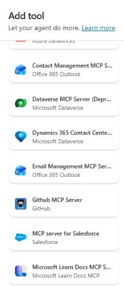

1. In the **Connection** section, select the dropdown arrow next to the text **Not connected**, and then select **Create new connection**.

	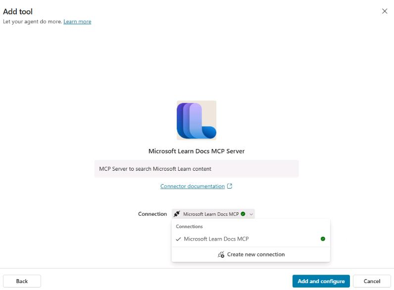

1. In the **Connect to Microsoft Learn Docs MCP** dialog, select **Create**.

	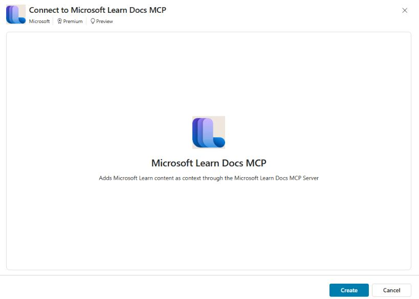

1. Select **Add and configure**.

	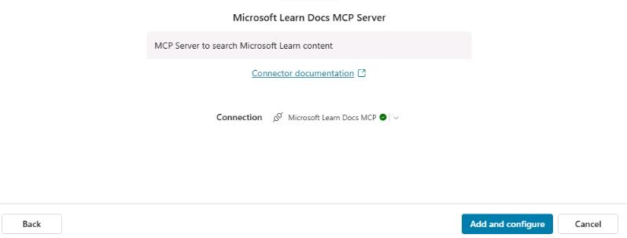

1. Wait while the MCP server is added. When the process is complete, the settings page for the MCP server displays.

	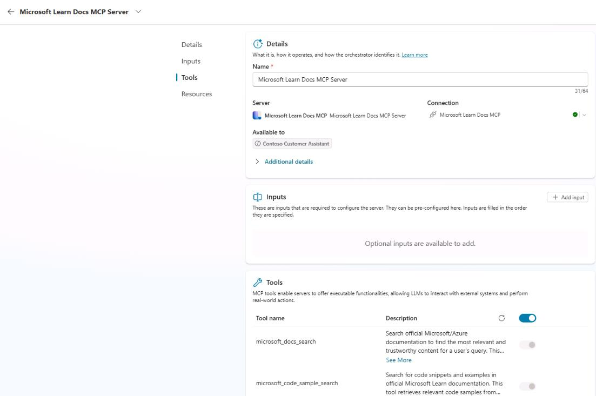

### 02: Configure MCP server settings

1. In the **Tools** section, disable **Allow all**.

	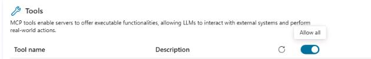

	{: .note }
	> By default, all tools for an MCP server are turned on. By disabling **Allow all** you can control which features are available.

1. Disable the **Microsoft_docs_fetch** tool. Leave the other tools enabled.

	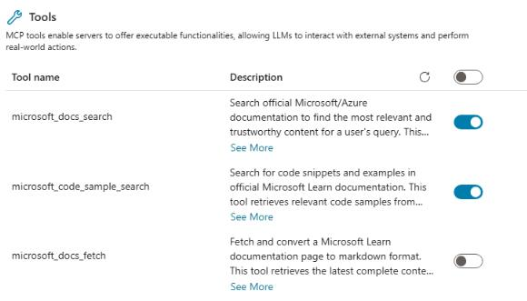

1. On the command bar for the agent, select **Save**.

	

---

### 03: Test the tool

1. Open the agent testing pane and then select **Start new test session**. 

	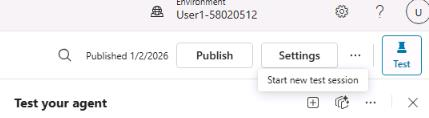

1. Submit the following prompt and review the response:

	```
	Show me articles from Microsoft Learn about adding MCP server resources to a Copilot Studio agent.
	```

	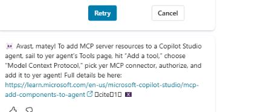

	{: .warning }
	> If you see a message about getting connected first, select the **Open connection manager** link and follow the instructions to connect to the MCP server.
	>
	> 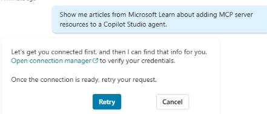
	>
	> 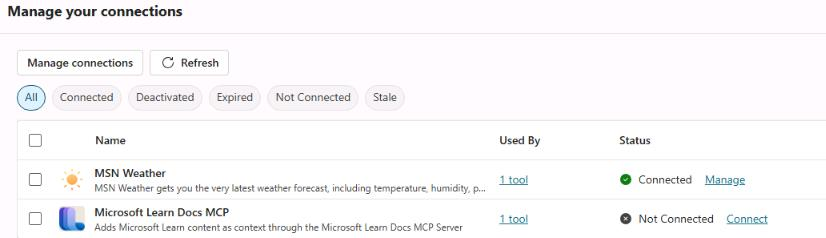

---

### Congratulations!
You've successfully completed the day one activities for the workshop. 