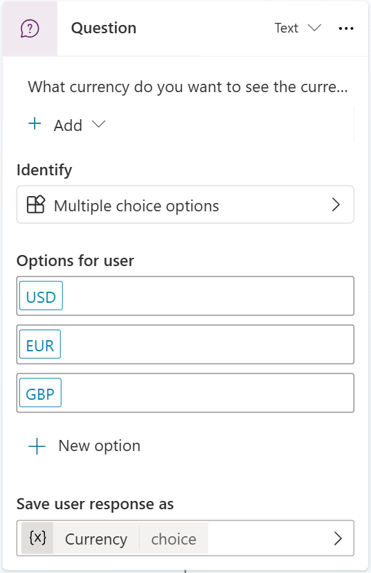
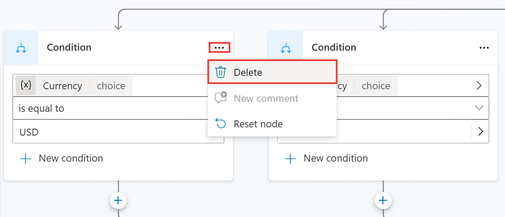
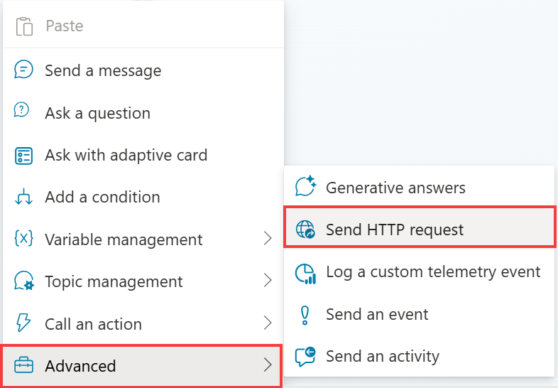
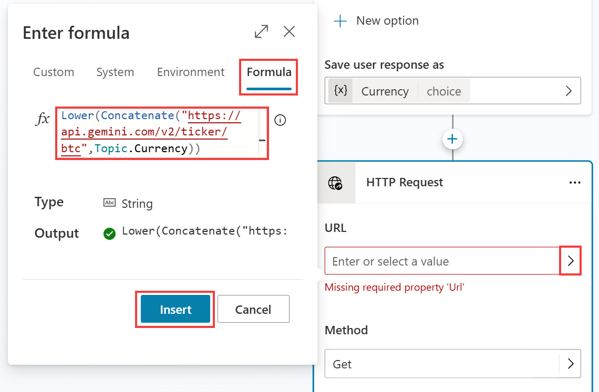
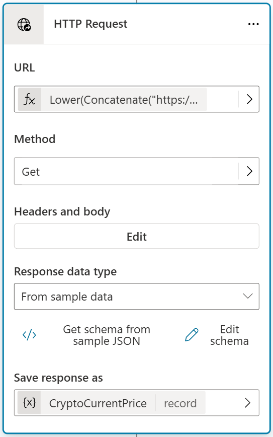
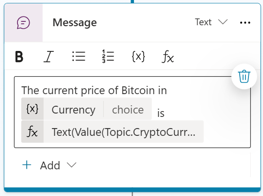

# Task 2: Create a new topic

1.	Open the Copilot Studio authoring canvas’ **Topics** page and click **Add a topic** drop down at the top of the screen, select the **From blank** option. Name your topic **Crypto Currency Price**.

2.	Add some **trigger phrases** that a user may ask such as the below ones

	```plaintext
	What's the current price of Bitcoin
	Can you tell me the latest crypto prices
	How much does Bitcoin cost now
	What are the prices of digital currencies today
	What's the latest on crypto prices
	```

1.	Create a new **Question** node and enter this text: **What currency do you want to see the current price of Bitcoin in?**.

2.	For the purpose of these labs, make the question a **Multiple choice options** in Identify.

	- Add the Options for user of **USD**, **EUR**, and **GBP**. Save response as a variable named **Currency**.
	- Add synonyms for each option, like **dollars**, **euros**, and **pounds**.

 	 

    >{: .important }
    >
    >**Pro tip**:
    >
    >You can add synonyms by selecting your options and adding synonyms like dollars for USD.

1.	Copilot Studio will automatically create the **choice condition logic** underneath the question node.

	- We will want to remove all the conditions for this scenario by clicking the ellipsis and then selecting **Delete**.

 	

2.	Next, you will want to add the **HTTP Request** node to make the API call to check the price of Bitcoin. You do this by clicking the **(+)** and go to **Advanced** and **Send HTTP request**.

 	

3.	Now we need to provide the information about the API to allow Copilot Studio to get the price of Bitcoin in the selected Currency. To do this, inside the **URL** field we will need to select **Formula** and put the following the Power Fx formula.

	**Lower(Concatenate("https://api.gemini.com/v2/ticker/btc",Topic.Currency))**

    

	This formula does several things. It makes sure that the URL passed in is lower case, then it concatenates the URL to include the currency that the user selected in the question above. This will make sure that the URL for USD or EUR for example is correct for the API.

1.	Now we need to provide a sample output of the JSON payload that will be returned by the API to allow the node to parse the response for us.

	- To do this you select **From sample data** in the **Response data type** field in the HTTP Request node.

	- **Select Get schema from sample JSON** and paste the below sample JSON payload.

    >{: .important }
    >
    >If you struggle copying the below text, go to **F:\LabFiles\Misc** and open the Bitcoin Sample JSON Payload.txt file.


	```json
	{
		"symbol": "BTCUSD",
		"open": "67781.09",
		"high": "68382.33",
		"low": "67293.74",
		"close": "67707.13",
		"changes": [
			"67882.6",
			"67781.09",
			"67805.66",
			"67744.15",
			"67651.01",
			"67863.46",
			"68053.16",
			"68080.11",
			"68186.09",
			"68109.26",
			"67914.8",
			"68079.54",
			"67455.47",
			"67468.58",
			"67712.98",
			"67662.82",
			"67771.15",
			"67680.26",
			"67799.25",
			"67736.21",
			"67653.87",
			"67698.36",
			"67832.24",
			"67707.13"
		],
		"bid": "67837.17",
		"ask": "67843.41"
	}
	```


1.	Select **Confirm**.

	  Then we will create a variable to store the parsed results from the API.

2.	Name the Variable **CryptoCurrentPrice**.

 	  

3.	Now, let’s add a message to give the user of your bot a formatted response to tell them the current price of Bitcoin. Click the (+) to add a new node and select **Send a message**. You can create your own message leveraging the variables to structure a response to the user about the price of Bitcoin.

	 >**The current bid price for Bitcoins in {Topic.Currency} is {Topic.CryptoCurrentPrice.bid}**

	 You can use a **formula** to format the price a specific way, for example with thousand separators and currency symbols:

	```json
	Switch(
		Text(Topic.Currency),
			"USD",
			Text(Value(Topic.CryptoCurrentPrice.bid),"$#,#.##"),
			"EUR",
			Text(Value(Topic.CryptoCurrentPrice.bid),"#,#.##€"),
			"GBP",
			Text(Value(Topic.CryptoCurrentPrice.bid),"£#,#.##")           
	)
	```

    

1.	To end the conversation, select **Topic management** and **Go to another topic** and select **End of Conversation**.

2.	Save your topic.
