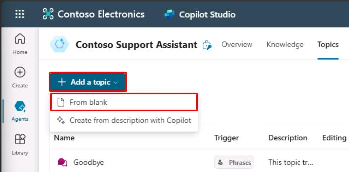

# Task 01: Create a new topic

## Introduction

Once external data sources are integrated, Contoso, Inc. needs to enhance their customer service agent's capabilities by enabling the agent to retrieve real-time data from external APIs.

## Description

In this task, you’ll create a new topic that allows the agent to make HTTP requests to an external API to retrieve information. You’ll configure the **HTTP Request** node and parse the response data.

## Success criteria

-   You successfully created a new topic with trigger phrases.
-   You configured the **HTTP Request** node to retrieve data from an external API.
-   You parsed the response data and displayed it to the user.


## Key tasks

### 01: Create a new topic

<details markdown="block"> 
  <summary><strong>Expand this section to view the solution</strong></summary> 

1. Select **Topics** on the top bar.

	

1. Select **Add a topic**, then select **From blank**.

	

1. Select **Untitled** in the upper-left part of the window, then change the topic name to `Crypto Currency Price`. 

1. Add some **Phrases** to the **Trigger** node that a user may ask:

	- `What's the current price of Bitcoin`
	- `Can you tell me the latest crypto prices`
	- `How much does Bitcoin cost now`
	- `What are the prices of digital currencies today`
	- `What's the latest on crypto prices`

	

1. Add a new **Question** node, then enter the following: 

	```
	What currency do you want to see the current price of Bitcoin in?
	```

1. Keep **Multiple choice options** as the entry for **Identify**.

1. Under **Options for user**, select **New option**, then enter in the following individually:

	- `USD`
	- `EUR`
	- `GBP`

	

1. Select the **USD** entry added, then select the **Edit synonyms** icon.

	

1. Under **Add synonyms**, enter `dollars`, then select **Enter** or the **+** button, then select **Done** at the bottom of the pane.

	

1. Repeat the steps for adding synonyms to the other currencies:

    | Currency | Synonym |
    |----------|-----------------|
    | **EUR** | `euros` |
    | **GBP** | `pounds` |

1. Under **Save response as**, select the **Var1** variable, then for **Variable name** enter `Currency`.

1. Under the **Question** node, select the **+** button, select **Advanced**, then select **Send HTTP request**.

	

1. In the **HTTP Request** node, under **URL**, select the chevron **(>)**, select the **Formula** tab, input the following Power Fx formula, then select **Insert**.

	```
	Lower(Concatenate("https://api.gemini.com/v2/ticker/btc",Topic.Currency))
	```

	

	{: .note }
	> This makes sure the URL passed in is lowercase, then concatenates it to include the currency that the user selected in the question about which currency to view Bitcoin in. This will make sure that the URL for USD or EUR, for example, is correct for the API.

1. Under **Response data type**, select the dropdown menu, then select **From sample data**.

	{: .note }
	> You'll need to provide a sample output of the JSON payload that will be returned by the API to allow the node to parse the response.

1. Select **Get schema from sample JSON**.

	

1. Paste the following sample data, then select **Confirm**.

	```json
	{
		"symbol": "BTCUSD",
		"open": "67781.09",
		"high": "68382.33",
		"low": "67293.74",
		"close": "67707.13",
		"changes": [
			"67882.6",
			"67781.09",
			"67805.66",
			"67744.15",
			"67651.01",
			"67863.46",
			"68053.16",
			"68080.11",
			"68186.09",
			"68109.26",
			"67914.8",
			"68079.54",
			"67455.47",
			"67468.58",
			"67712.98",
			"67662.82",
			"67771.15",
			"67680.26",
			"67799.25",
			"67736.21",
			"67653.87",
			"67698.36",
			"67832.24",
			"67707.13"
		],
		"bid": "67837.17",
		"ask": "67843.41"
	}
	```

	

1. Under **Save response as**, create a new variable, then update the name to `CryptoCurrentPrice`.

	

1. Add a new **Message** node under your **HTTP Request** node.

1. Set a message leveraging the new variables to structure a response to the user about the price of Bitcoin:

	```‌
	The current bid price for Bitcoin in {Topic.Currency} is {Topic.CryptoCurrentPrice.bid}
	```

	

1. Improve the formatting of the price with currency symbols and separators for the thousands.

1.	Delete the final variable of the message you just added: "**{Topic.CryptoCurrentPrice.bid}**".

	

1. Select the **fx** button in the **Message** node, enter the following formula, then select **Insert**.

	```json
	Switch(
		Text(Topic.Currency),
			"USD",
			Text(Value(Topic.CryptoCurrentPrice.bid),"$#,#.##"),
			"EUR",
			Text(Value(Topic.CryptoCurrentPrice.bid),"#,#.##€"),
			"GBP",
			Text(Value(Topic.CryptoCurrentPrice.bid),"£#,#.##")           
	)
	```

	

	

	{: .note }
	> This formats the price with currency symbols and separators for the thousands.

1. Below the **Message** node, select the **+** button, select **Topic management**, select **Go to another topic**, then select **End of Conversation**.

	

1. Select **Save** in the upper-right part of the canvas to save the topic.

1. Select the refresh icon in the upper-right corner of the **Test your agent** pane to start a new conversation.
 
1. Test this with the following prompt: 

	```
	What's the current bid price for Bitcoin in dollars?
	```

    

</details>

You've successfully created an **HTTP Request** node to provide real-time data from an external service to the user!


## Summary

Congratulations on completing Exercise 04! You've successfully:

- Created an HTTP API call through the **HTTP Request** node in Copilot Studio.
- Structured a GET API call using Power Fx.
- Displayed dynamic data back to the user in Copilot Studio.