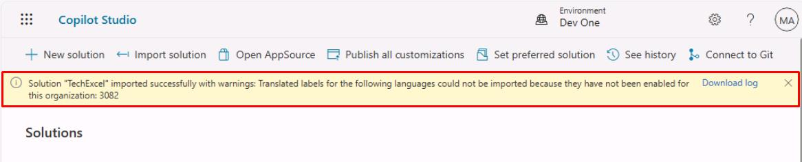

# Appendix - Upload a pre-built agent

{: .warning }
> The virtual machine for this lab environment includes a solution that includes a partially complete agent. The solution has all of the features and functionality for exercises 1-4. 
> 
> If you experienced issues early in the workshop and need to import the solution with the agent, alert your coach first and then complete the following steps. You will still need to complete exercised 05-07.

1. In Copilot Studio, in the left pane, select **Agents**.

    

1. In the upper-left part of the page, select **Import agent**.

    

    {: .note }
    > This will open the **Solutions** page in a new tab.

1. Select **Import solution** on the top bar.

    

1. Select **Browse** in the new pane.

1. In the top address bar, select the empty white space to the right of **Admin >** to change the file path, then enter `F:\LabFiles\Solution`.

    
    

    {: .note }
    > Alternatively, expand for navigating through the folders manually:
    > 1. In the left pane, move down to under **This PC**, then select **AllFiles (F:)**.
    >
    > 
    > 1. Double-click **LabFiles**.
    > 2. Double-click **Solution**.

1. Select **TechExcel_1_0_0_1.zip**, then select **Open**.

    

1. Select **Next** in the lower-left corner of the pane.

    

1. Select **Import** in the lower-left corner of the pane.

1. Wait until you see a yellow warning banner under the top bar upon completion. The warning can be safely ignored.

    

    

    {: .warning }
    > It may take a couple of minutes to complete the import of the agent.

    {: .note }
    > This is the definition of the agent, not the running version. This comes with various internal components that you'll explore in the upcoming exercises.

1. After the import finishes, close the **Solutions** page tab to return to Copilot Studio.

1. Select **Home** in the leftmost menu.

    