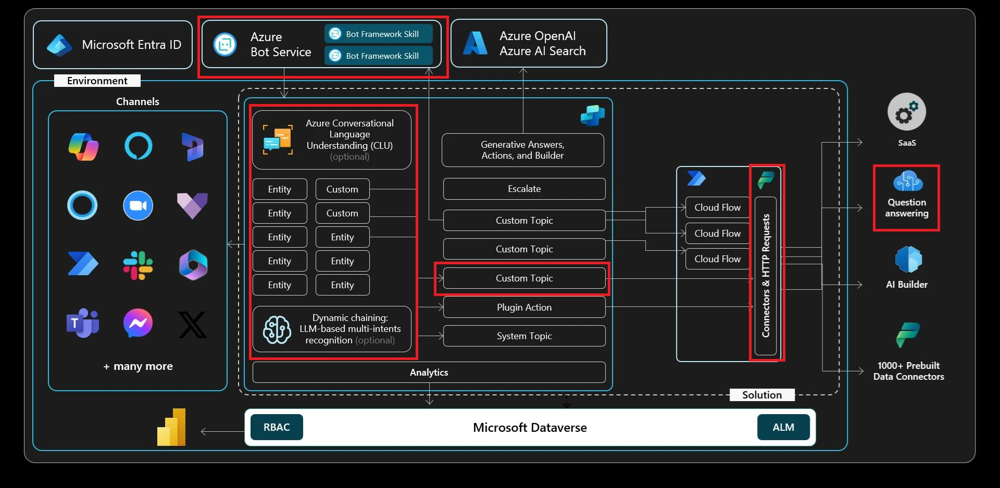

# Exercise 04: Make HTTP requests to connect to an API
 
## Scenario

Contoso's support engineers often need live information that isn’t stored in internal systems — for example, share prices or third‑party service metrics. To provide customers with near‑real‑time answers, the Copilot agent must be able to call external REST APIs directly and surface the results in chat. This exercise walks through building a topic that issues an HTTP GET request, parses the JSON response, and presents the data in a user‑friendly message.

## Objectives

In this exercise, you'll create a new topic, add a simple **HTTP Request** node action to retrieve information from an external service, then display that data back to the user.

After this exercise, you'll be able to:

-   Understand the basics of the **HTTP Request** node.
-   Use Copilot Studio to request data from another data source using the **HTTP Request** node, then return the data in a conversational dialog with the end user.

## Architecture

## Duration

Estimated time: 2*0 minutes*.	