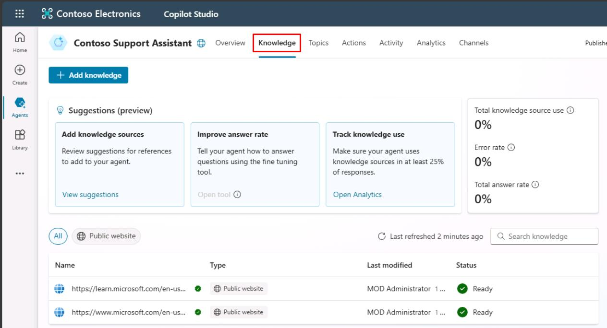
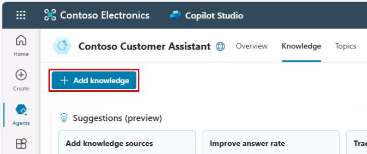
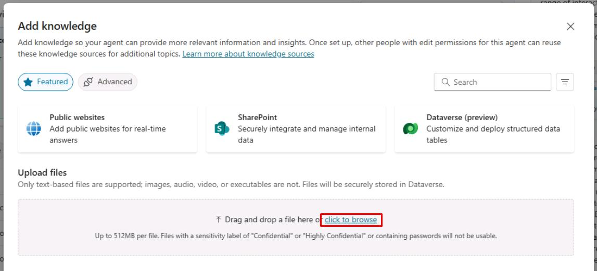
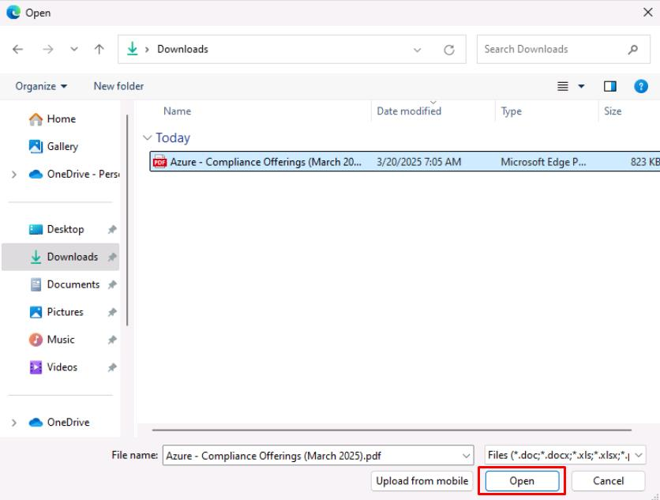
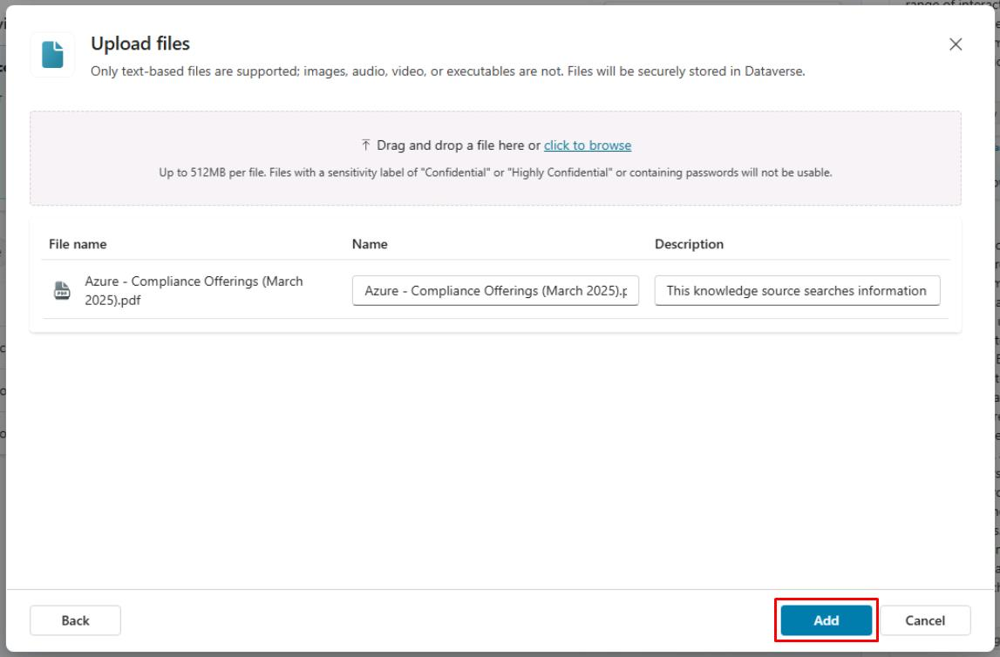

# Task 01: Configure the Files knowledge source

## Introduction

Contoso, Inc. needs to enhance their customer service agent by integrating various knowledge sources to provide accurate and timely information to their customers. This task demonstrates how to configure the Files knowledge source.

## Description

In this task, you’ll upload a PDF file to Microsoft Copilot Studio and configure it as a knowledge source for the agent. This will enable the agent to retrieve information from the file and provide relevant answers to customer queries.

## Success criteria

-   You successfully uploaded a file and configured it as a knowledge source.
-   You verified that the agent can access and retrieve information from the file.
-   You tested the knowledge source by asking relevant questions.

## Key tasks

### 01: Configure the Files knowledge source

 
  
<strong>Expand this section to view the solution</strong>
 

{: .warning }
> If you imported the pre-built Copilot solution using the .zip file at the start of the lab, you'll need to start following along with the steps from here.

1. Select **Knowledge** on the top bar.

	

	{: .note } 
	> You'll see the websites added as knowledge sources during creation.
	>
	> - **[https://learn.microsoft.com/en-us/microsoft-copilot-studio/](https://learn.microsoft.com/en-us/microsoft-copilot-studio/)**
	> - **[https://www.microsoft.com/en-us/microsoft-copilot/](https://www.microsoft.com/en-us/microsoft-copilot/)**

1. Open a new tab, then go to `https://servicetrust.microsoft.com/DocumentPage/7adf2d9e-d7b5-4e71-bad8-713e6a183cf3`.

1. Select **Download**.

	

1. Return to your Copilot Studio tab.

1. Select **Add knowledge** in the upper-left part of the window.

	

1. Under **Upload files**, select **click to browse**.

	

1. Go to your **Downloads** folder, select the **Azure - Compliance Offerings** PDF, then select **Open**.

	

1. Select **Add** in the lower-right part of the pane.

	

