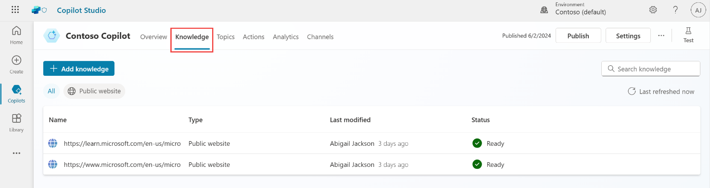
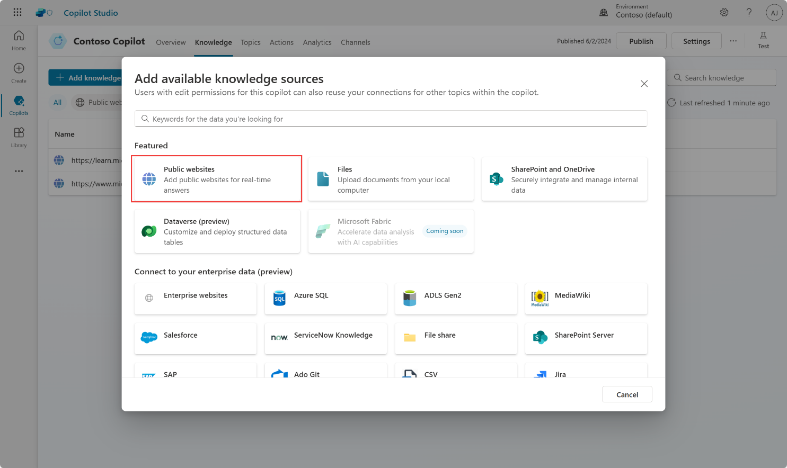

# Task 01: Configure website knowledge sources

>{: .warning }

 The Dataverse section **will not work** unless you redeem a Power Platform trial, expand this section for instructions on obtaining one.

  ## Get a Free Trial of Microsoft Power Platform

   To obtain a free trial of Microsoft Power Platform, follow these steps:

   1. Navigate to **[https://powerpages.microsoft.com](https://powerpages.microsoft.com)** and click **Try it for free**.

   2. Complete the onscreen instructions by entering your work or school email address (**@lab.CloudPortalCredential(user1).Username**), your country/region, and your phone number.

   3. A new Microsoft Power Platform trial environment will be automatically created for you.

   ### Alternative option
 
   Alternatively, if you're interested in a 30-day free trial of customer engagement applications like Dynamics 365 Sales, Dynamics 365 Customer Service, and Dynamics 365 Marketing:

   1. Visit **[https://trials.dynamics.com](https://trials.dynamics.com)**.

   2. Select the application you want to try.

1.	Navigate to the **Knowledge** tab of your copilot.

 	

 	- From previous labs, you may see existing knowledge sources, such as public websites.

		- **[https://learn.microsoft.com/en-us/microsoft-copilot-studio/](https://learn.microsoft.com/en-us/microsoft-copilot-studio/)**

		- **[https://www.microsoft.com/en-us/microsoft-copilot/](https://www.microsoft.com/en-us/microsoft-copilot/)**

1.	Select **Add knowledge**.

2.	Consider adding a new **website**, such as **[https://adoption.microsoft.com/en-us/](https://adoption.microsoft.com/en-us/)**.

Make sure each knowledge source has a good name and explicit description of what it can return.

{: . important }
>**Pro tips**:  
    - When using the default built-in natural language understanding model, knowledge sources are invoked from the Create generative answers node. By default, user sentences that don’t trigger a topic will go to the Conversational boosting topic, where a generative answers node is pre-configured.  
    - When generative AI orchestration is enabled, the large language model will look at each knowledge source model description to know what data source to use to answer a user query.
