## Task 01: Configure knowledge sources

### Introduction

Contoso, Inc. needs to enhance their customer service agent by integrating various knowledge sources to provide accurate and timely information to their customers. This task demonstrates how to configure the Files knowledge source.

### Description

In this task, you'll upload a PDF file to Microsoft Copilot Studio and configure it as a knowledge source for the agent. This will enable the agent to retrieve information from the file and provide relevant answers to customer queries.

### Success criteria

- You successfully uploaded a file and configured it as a knowledge source.
- You verified that the agent can access and retrieve information from the file.
- You tested the knowledge source by asking relevant questions.

## Key tasks

---

#### 01: Configure the Files knowledge source

1. Open a new browser window and go to:

	```
	https://servicetrust.microsoft.com/DocumentPage/7adf2d9e-d7b5-4e71-bad8-713e6a183cf3
	```

1. Select **Download**.

	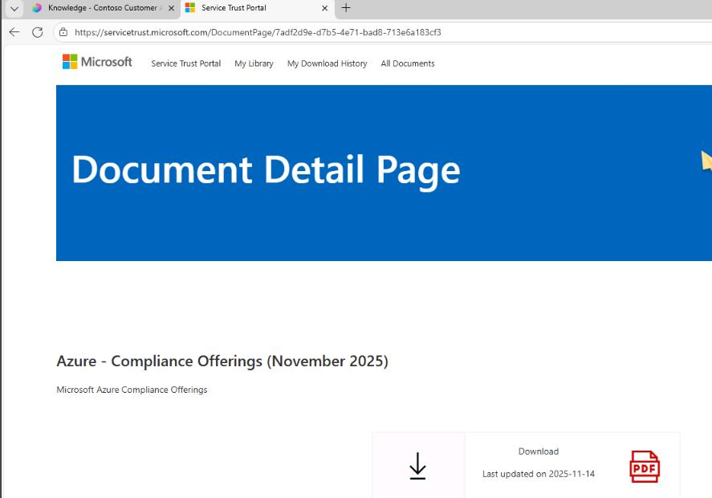

1. Return to the browser window where the agent is displayed.

1. On the command bar for the agent, select **Knowledge**.

	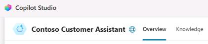

1. Select **+ Add knowledge**.

	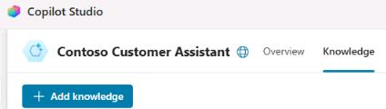

1. In the **Add knowledge** dialog, select **Upload file**.


	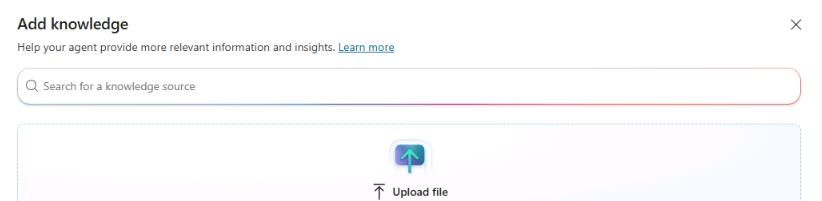
	
1. In the **Select files this site can read** dialog, go to your **Downloads** folder, select the **Azure - Compliance Offerings** PDF, and then select **Open**.

	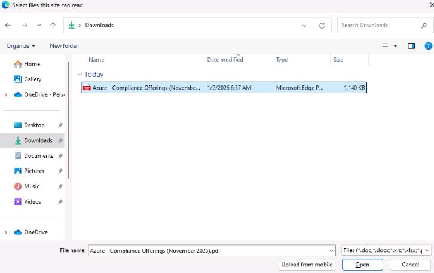

1. In the **Upload files** dialog, select **Add to agent**.

	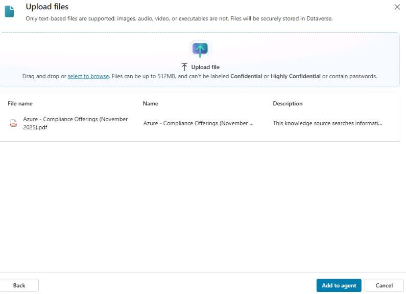

1. Leave the agent page open.
---


#### 02: Configure a SharePoint knowledge source

1. Select **+ Add knowledge**.

	

1. In the **Add knowledge** dialog, select **SharePoint**.

	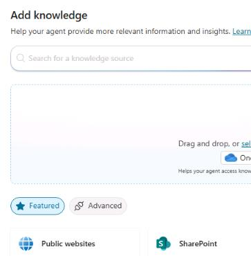

1. In the **SharePoint** dialog, select **Browse items**.

	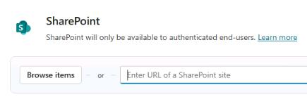

1. Select **SharePointFiles** and then select **Confirm selection**.

	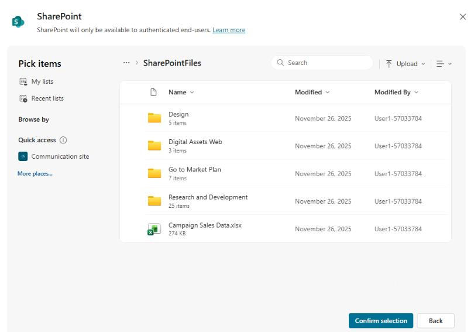

1. Select **Add to agent**.

	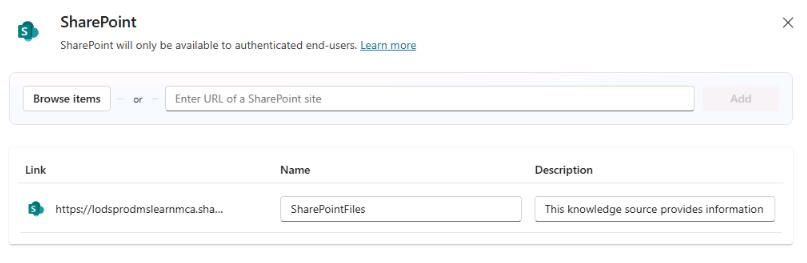
	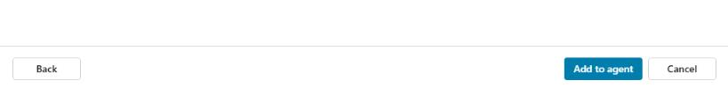

1. Leave the agent page open.

---

#### 03: Configure a Dataverse knowledge source


1. Select **+ Add knowledge**.

	

1. In the **Add knowledge** dialog, select **Dataverse**.

	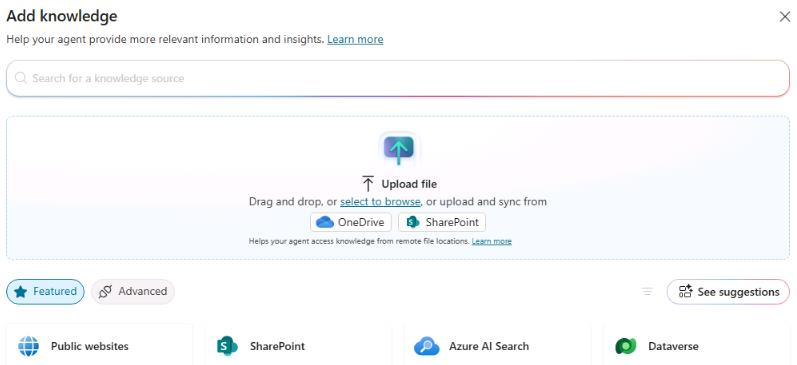

1. Select the **Account** table and then select **Add to agent**.

	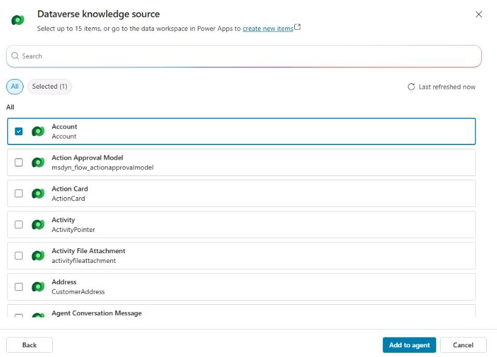

1. On the **Knowledge** pane for the agent, locate the **Account** knowledge source. Select the vertical ellipsis and then select **Edit**.

	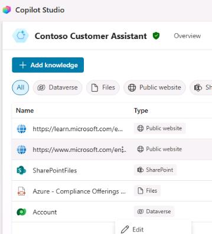

1. Select the **Synonyms** tab.

	

1. Locate the record for **Address 1** and then select **Add synonyms**.

	

1. In the **Add synonyms** dialog, enter `Address`, select **Add**, and then select **Done**.

	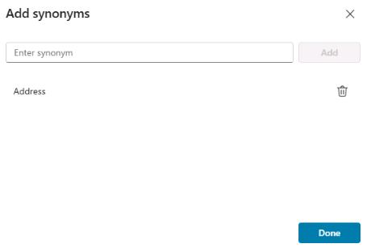

1. In the **Description** field for the **Address 1** record, enter `Complete address of the account`.

	

1. On the command bar for the agent, select **Save**.

	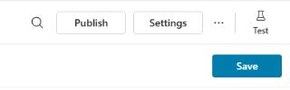

1. On the command bar for the **Account** knowledge source, select **Glossary**.

	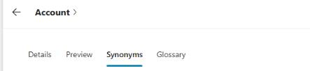

1. Use the following information to configure a glossary record and then select **Add**:

	| Item | Value |
	| ---- | ----- |
	| **Enter term** | `Customer` |
	| **Enter description** | `Customer is a synonym for account` |


	{: .note }
	> Adding the synonym and glossary record helps the agent understand questions about accounts.

	

1. On the command bar for the agent, select **Save**.

	

---

#### 04: Configure authentication
The Dataverse data source requires authentication because searches are done in the context of the connected end user. 

1. On the command bar for the agent, select **Settings**.

	

1. In the list of settings, select **Security**.

	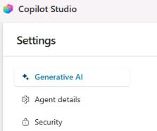

1. Select **Authentication**, select **Authenticate with Microsoft**, and then select **Save**.

	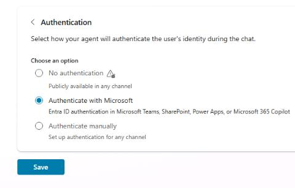

1. In the confirmation dialog that displays, select **Save**.

	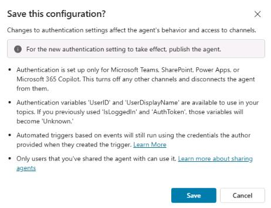

1. Close the **Settings** page to return to the **Knowledge sources** page.

---

#### 05: Configure a website knowledge source
To provide additional information to Contoso's customers, you can integrate a website as a knowledge source.

1. Select **+ Add knowledge**.

	

1. In the **Add knowledge** dialog, select **Public websites**.

	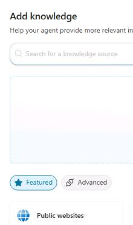

1. Enter 

	```
	https://adoption.microsoft.com/en-us/
	```
	
	and then select **Add**.

	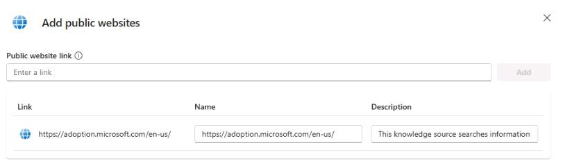

1. Select **Add to agent**.

	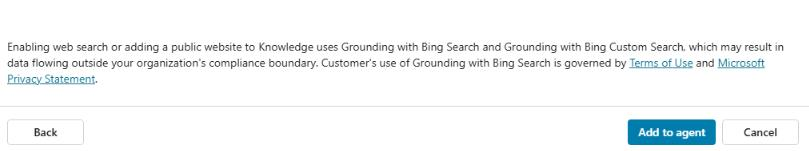


---

#### 06: Test website knowledge sources

1. Open the agent testing pane and then select **Start new test session**. 

	

1. Submit the following prompt:

	```
	What is Microsoft Copilot Studio?
	```

	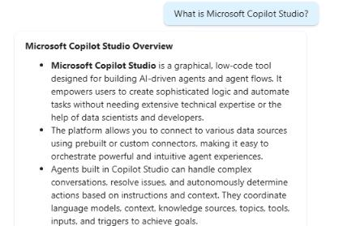
	

	{: .note }
	> This specific question was chosen because it doesn't match an existing topic. Instead, it will trigger the **Conversational boosting** topic.
	>
	> Notice there's a citation to ground the answer on, and links to the sources that were used to generate the answer.

1. Submit the following prompt to ask a follow-up question:

	```
	How do people use it in their business environments?
	
```

	{: .note }
	> Although the follow-up question does not mention a specific product, the generative answer maintains context, ensuring the follow-up is interpreted in relation to the previous message.