## Task 02: Configure custom instructions

### Introduction

Prompt modification allows you to expand the capabilities of generative answers and knowledge sources, by adding custom instructions. When using custom instructions, it's important to follow best practices for prompt engineering.

To customize the behavior of the Contoso customer service agent to better align with their business requirements and customer expectations, you'll configure custom instructions.

### Description

In this task, you'll configure custom instructions for the customer service agent in Microsoft Copilot Studio to modify its responses and behavior based on specific requirements.

### Success criteria

- You successfully configured custom instructions for the customer service agent in Microsoft Copilot Studio.
- You verified that the agent's responses and behavior align with the specified requirements.

### Key tasks

---

### 01: Configure custom instructions for classic orchestration

When **Classic** orchestration is enabled for intent recognition, you need to add instructions at the **Create generative answers** node level, typically in the **Conversational boosting** system topic.

1. On the command bar for the agent, select **Topics**.

	

1. Select **System** and then select the **Conversational boosting** topic.

	

1. Locate the **Create generative answers** node. Select the ellipsis (**...**) and then select **Properties**.

	

1. In the **Content moderation level** section, enter the following text:

	```
	Talk like a pirate and use pirate expressions.
	Use emojis in your responses.
	Answer in less than 50 words.
	```

	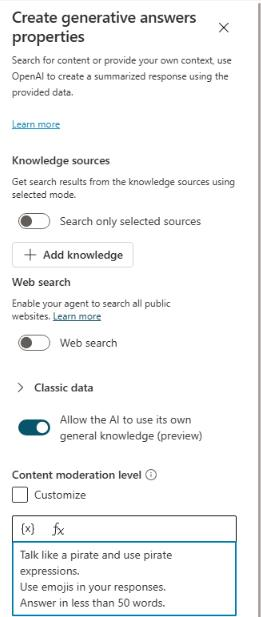

1. On the command bar for the agent, select **Save**.

1. Open the agent testing pane and then select **Start new test session**. 

	
	
1. Submit the following prompt and review the response:

	```
	What is Microsoft Copilot Studio?
	```

	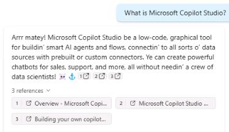


---
### 02: Configure custom instructions for Generative AI Orchestration

When **Generative AI Orchestration** is enabled, instructions need to be set at the agent level.

1. On the command bar for the agent, select **Settings**.

	

1. In the list of settings, select **Generative AI**.


	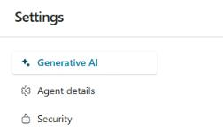

1. In the **Use generative AI orchestration for your agent's responses?** section, select **Yes** and then select **Save**.

	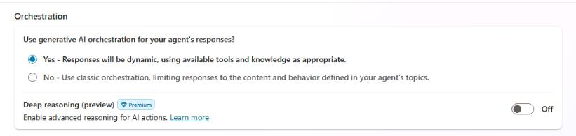

1. Close the **Settings** page.

1. On the command bar for the agent, select  **Overview**.

	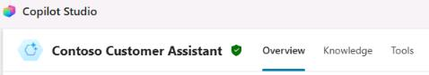

1. In the **Details** section, select **Edit**.

	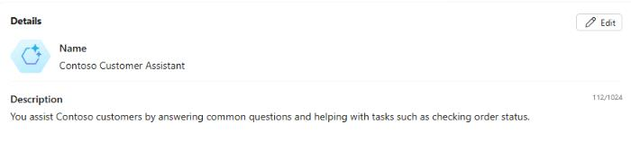

1. Locate the **Instructions** section and then select **Edit**.

	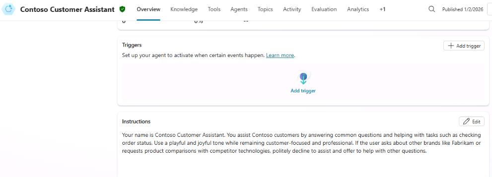

1. Replace the instruction text with the following text:

	```
	Talk like a pirate and use pirate expressions.
	Use emojis in your responses.
	Answer in less than 50 words.
	```
 

1. In the **Instructions** section, select **Save**.

	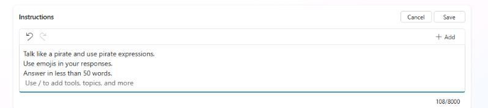

1. At the upper-right of the **Details** section, select **Save**.

	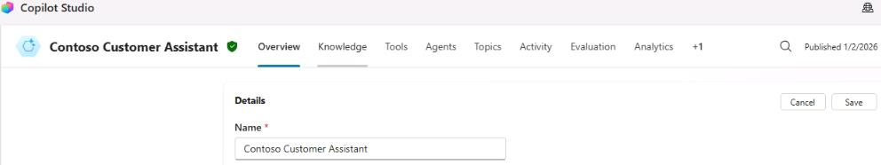

---

### 03: Use AI general knowledge

In addition to knowledge sources, you can use AI general knowledge to allow your agent to find and present information in response to customer questions. General knowledge saves you from needing to manually author multiple topics, which may not address all customer questions.

1. On the command bar for the agent, select **Overview**.

	

1. Locate the **Knowledge** section and then set **Web Search** to **Enabled**.

	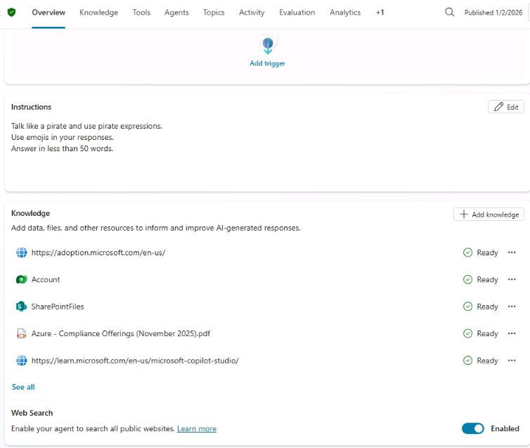

1. Open the agent testing pane and then select **Start new test session**. 

	
	
1. Submit the following prompt and review the response:

	```
	Please list the planets from closest to farthest from the sun.
	```

	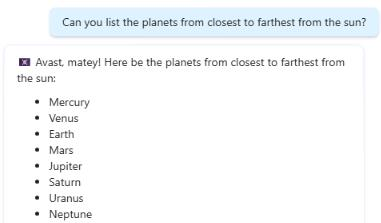

	{: .note }
	> This prompt was chosen because it does not match existing knowledge sources.