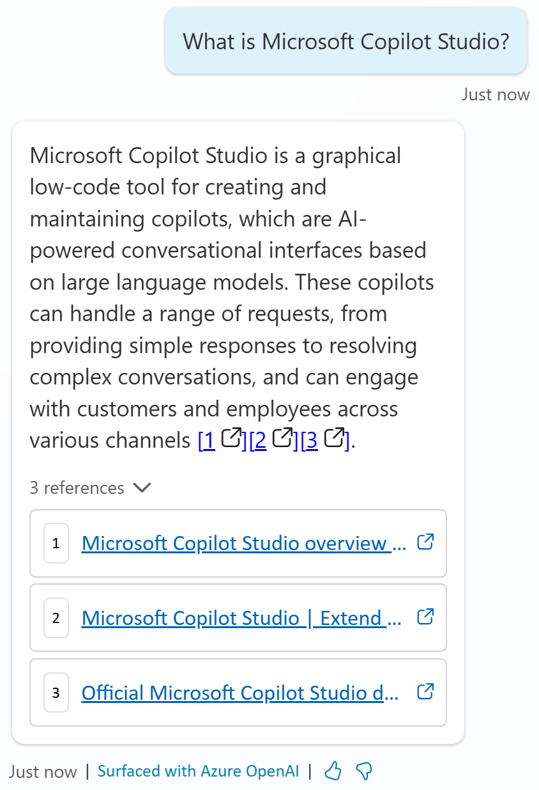
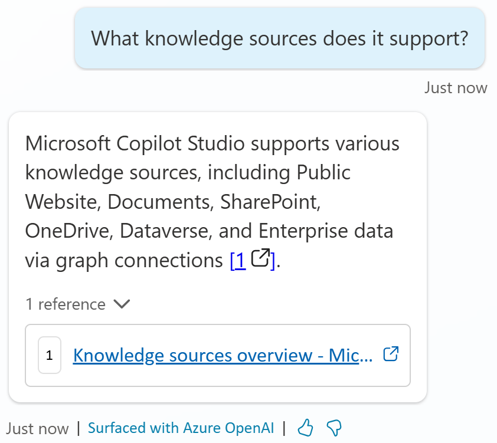

# Task 02: Test website knowledge sources

1.	Launch the **Test** pane.

2.	Ask a question that doesn’t match an existing topic to trigger the **Conversational boosting** topic.

3.	Enter the following prompt:

	>**What is Microsoft Copilot Studio?**

1.	Notice that it generates an answer and includes **citations** to ground its answer on and offer the user the option to navigate to the **sources** that were used to generate this answer.

    

1.	Ask a **follow up** question.

	>**What knowledge sources does it support?**

    

	{: .note }
  > Notice that even though the follow up question didn’t refer to the specific product this question applied to, the generative answers features made sure context was preserved and that the follow up question was interpreted in context of the previous messages in the conversation.

