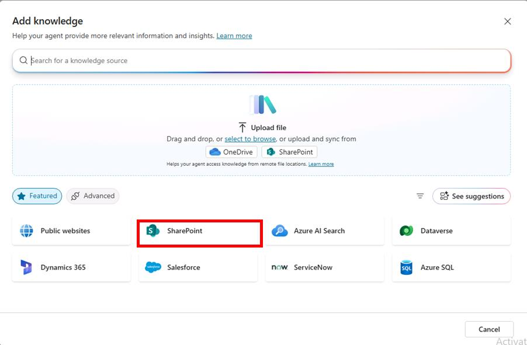
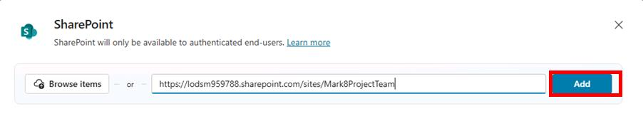
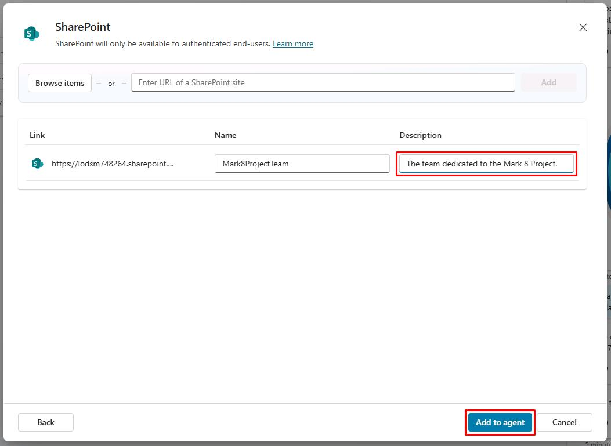

# Task 02: Configure a SharePoint knowledge source

## Introduction

After configuring the Files knowledge source, you can integrate SharePoint as a knowledge source to enhance the agent's ability to provide accurate information.

## Description

In this task, you’ll configure the SharePoint knowledge source to allow the agent to access and retrieve information from SharePoint sites. You’ll set up the SharePoint URL and configure access permissions.

## Success criteria

-   You successfully configured the SharePoint knowledge source with the correct URL and access permissions.
-   You verified that the agent can access and retrieve information from the SharePoint site.
-   You tested the knowledge source by asking relevant questions.


## Key tasks

### 01: Configure a SharePoint knowledge source

1. Select **Add knowledge** in the upper-left part of the window.

1. Select **SharePoint**.

	

1. In the text box, enter the following URL, then select **Add**. 

	```
    https://@lab.CloudCredential(M365).TenantPrefix.sharepoint.com/sites/Mark8ProjectTeam
    ```

	 

1. In the **Description** field, enter `The team dedicated to the Mark 8 Project.`, then select **Add** in the lower-right part of the pane.

	