# Task 03: Configure a Dataverse knowledge source

## Introduction

With the SharePoint knowledge source now configured, you can next configure a Dataverse knowledge source so that Contoso's agent can access structured data from Dataverse to deliver detailed information to customers.

## Description

In this task, you'll set up the Dataverse knowledge source to enable the agent to access and retrieve information from Dataverse tables. This involves establishing the Dataverse connection and configuring the required tables.

## Success criteria

-   You successfully configured the Dataverse knowledge source with the correct connection and tables.
-   You verified that the agent can access and retrieve information from the Dataverse tables.
-   You tested the knowledge source by asking relevant questions.

## Key tasks

### 01: Configure a Dataverse knowledge source

 
  
<strong>Expand this section to view the solution</strong>
 

The Dataverse knowledge source allows users to make natural language queries over structured data, stored in Dataverse tables.

1. Select **Add knowledge** in the upper-left part of the window.

1. Select **Dataverse**.

	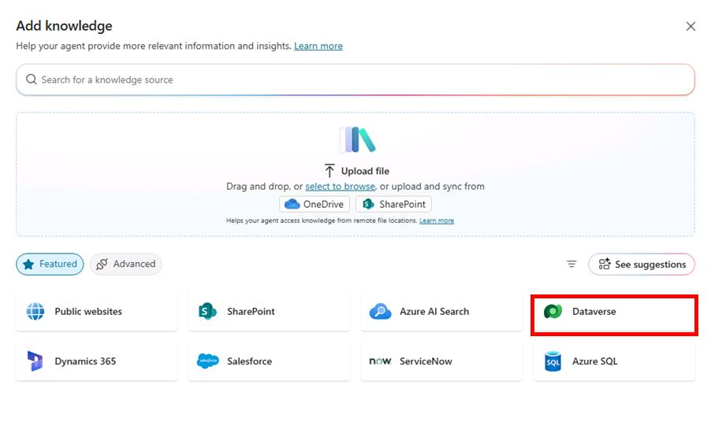

1. Under **All**, select **Account**, then select **Add to agent** in the lower-right corner of the pane.

	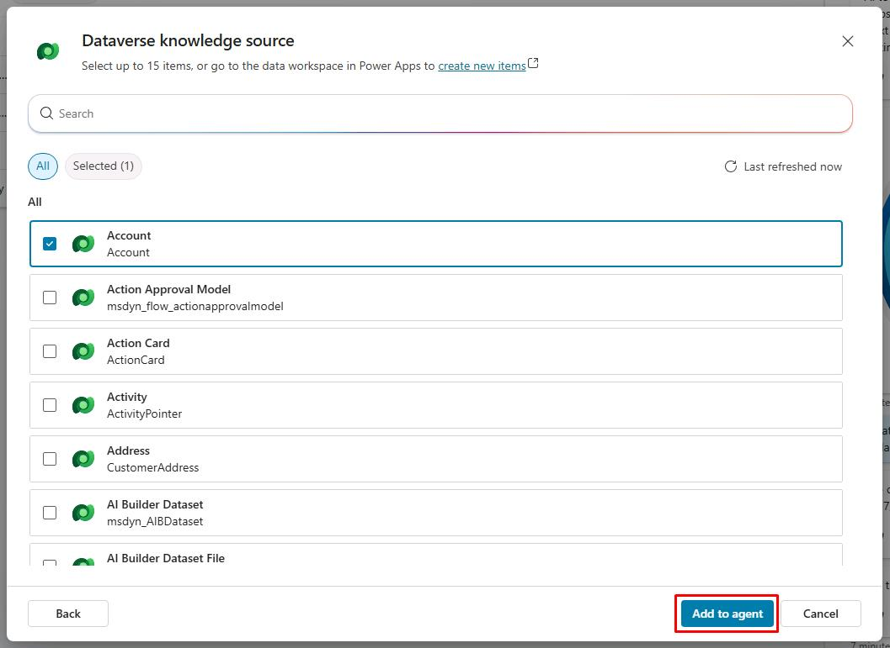

1. On the table, next to **Account**, select the vertical ellipsis, then select **Edit**.

	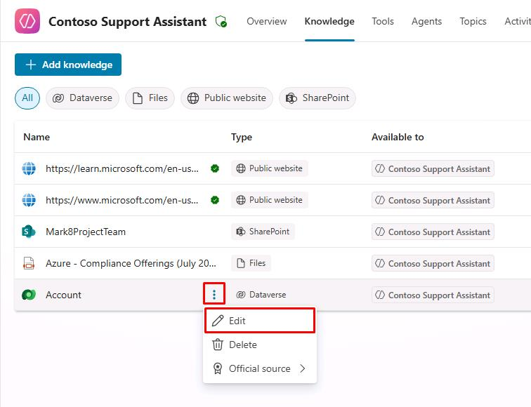

1. Select the **Synonyms** tab.

	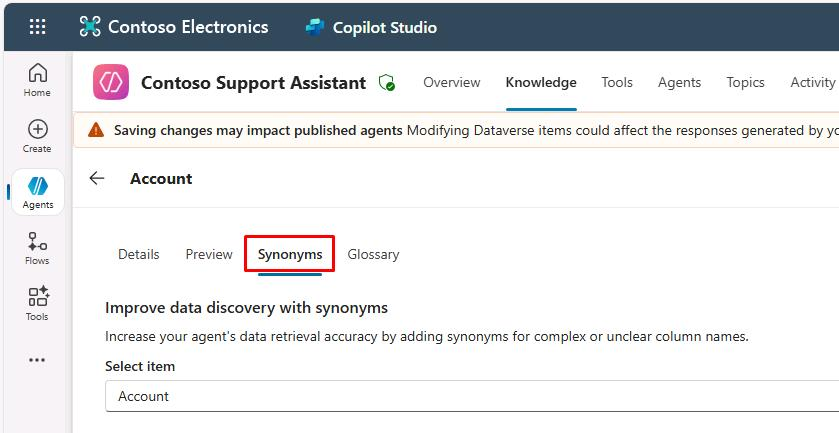

	{: .note }
	> You'll improve the understanding of questions about specific attributes of the table.

1. Find the line for **Address 1**, then select **Add synonyms**.

	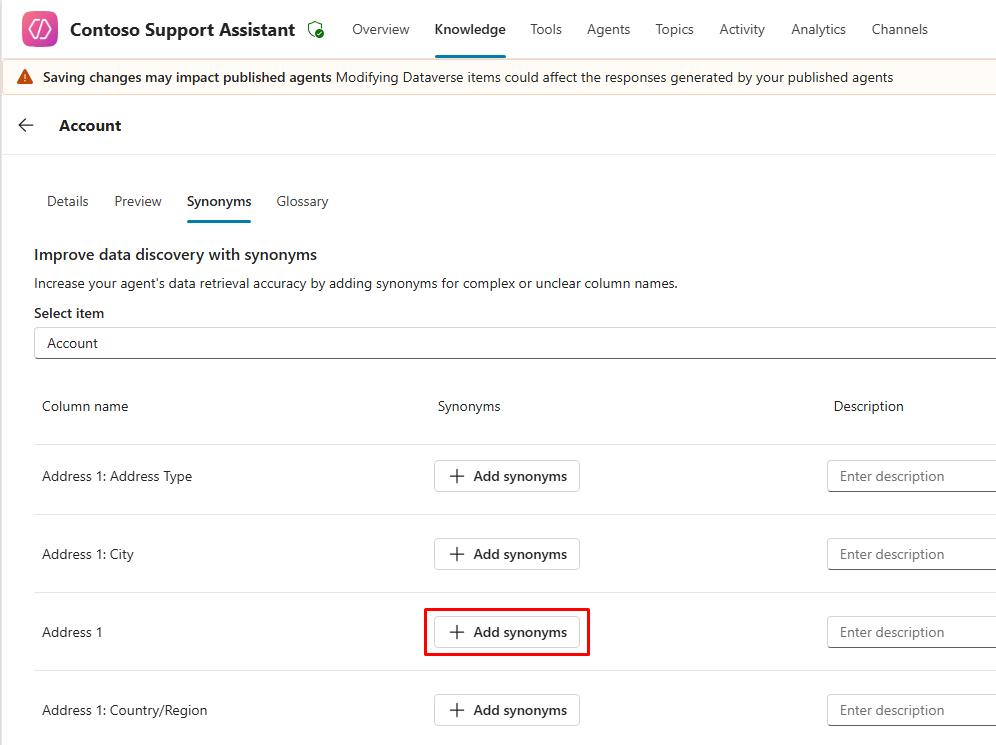

1. Enter `Address`, select **Add**, then select **Done**.

	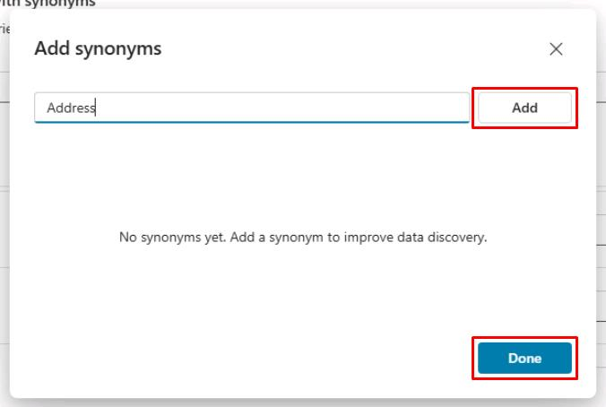

1. In the **Description** field, enter `Complete address of the account`.

1. Select **Save** in the upper-right corner of the pane.

    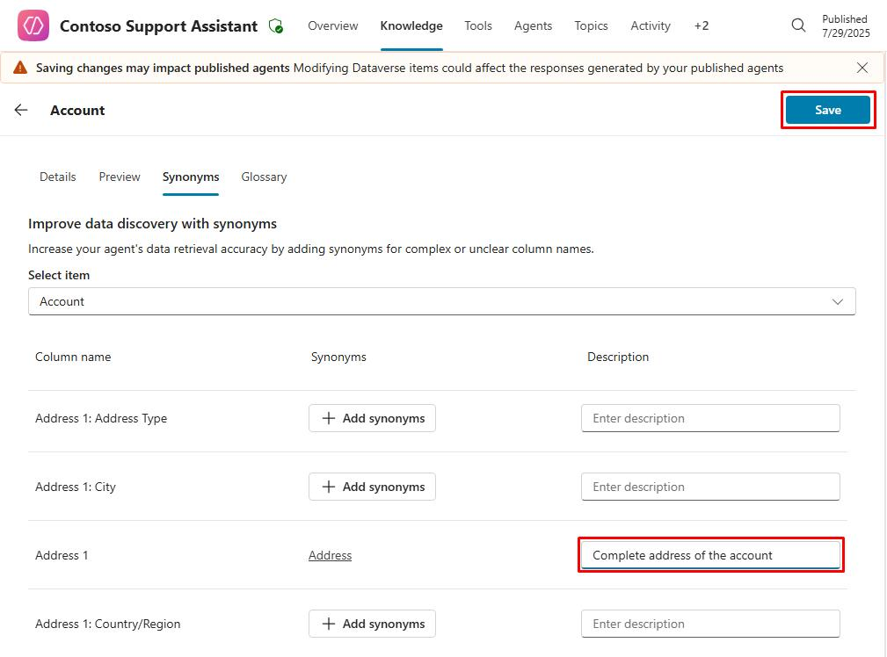

1. Select the **Glossary** tab.

    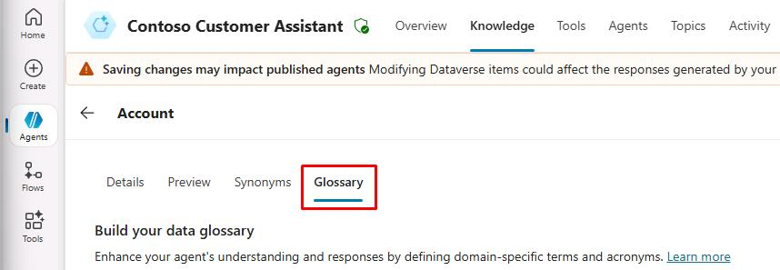

1. Enter the following:

	| Item | Value |
    |----------|----------------------|
    | **Enter term** | `Customer` |
    | **Enter description** | `Customer is a synonym for account` |

1. Select **Add**.

	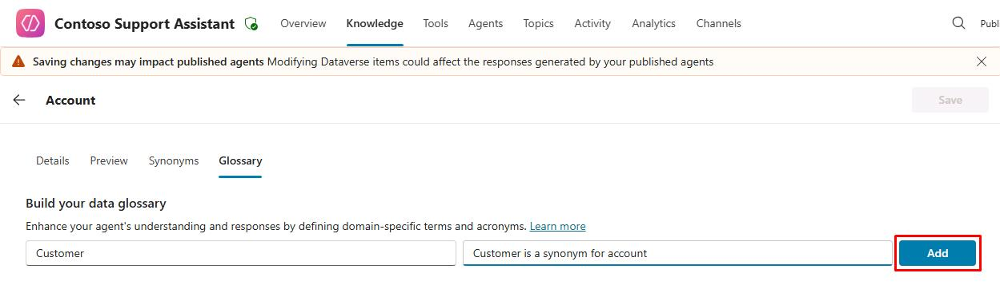

	{: .note }
    > This improves the understanding of user questions about accounts.

1. Select **Save** in the upper-right corner of the pane.

1. **Dataverse** is an internal data source, so end users have to be signed in.

    Select **Settings** near the upper-right corner of the page.

	
	
1. Select **Security** on the left settings menu.

1. Select **Authentication**, select **Authenticate with Microsoft**, then select **Save**.

	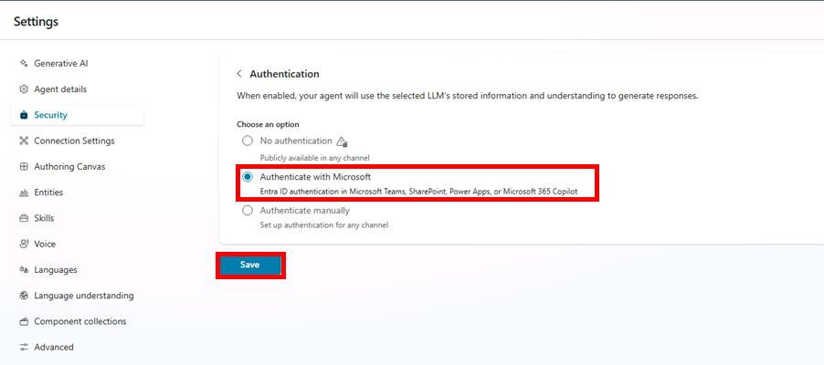

    {: . important }
    > This data source requires authentication because searches are done in the context of the connected end user. Only records the end user has read access to, at minimum, are returned and summarized.

1. Select **Save** on the dialog.

1. Once successfully saved, select the **X** in the upper-right part of the Settings page to return to your knowledge sources.

	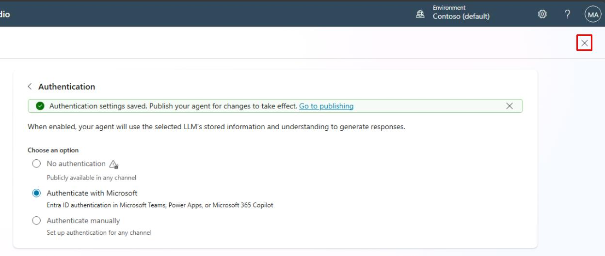

    
