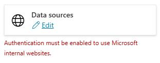

## Task 03: Test other knowledge sources and publish the updated agent

### Introduction

Now that you've configured knowledge sourceds you need to do some testing.

### Description

In this task, you'll test the knowledge sources that you configured.

### Success criteria

- You successfully reviewed the **Generative answers** node in Microsoft Copilot Studio.
- You verified that the agent can retrieve structured data from the configured knowledge sources and provide relevant answers.
- You've published the agent.

### Key tasks

---

### 01: Review the **Generative answers** node

1. On the command bar for the agent, select **Topics**.

	

1. Select **System** and then select the **Conversational boosting** topic.

	

1. Locate the **Create generative answers** node. Select the ellipsis (**...**) and then select **Properties**.

	

1. In the **Knowledge sources** section, set **Search only selected sources** to **On** (enabled).

	

	{: .note }
	> With this option enabled, you can hand pick the knowledge sources that should be used when entering that specific node.

1. Select all the available knowledge sources by selecting the checkbox next to the **Name** header.

	

1. In the **Classic data**section, set **Allow the AI to use its own general knowledge** to **Off** (disabled).

	

1. In the **Content moderation level** section, select the **Customize** checkbox.

	

	{: .important }
	> The **Content moderation** setting helps keep the agent from hallucinating (coming up with a wrong answer to a question by misinterpreting or overinterpreting grounding data).

	

1. On the command bar for the agent, select **Save**.

	

	{: .warning }
	> Disregard any authentication errors that may display, as they won't apply to the tests in this lab.
	> 
	> 

---

### 02: Test the Dataverse knowledge source

1. On the command bar for the agent, select **Knowledge**.

1. Verify **Dataverse** shows as **Ready** under **Status** before proceeding.

	
	

1. Open the agent testing pane and then select **Start new test session**. 

	

1. Submit the following prompt and review the response:

	```
	Which customers are located in Redmond? List them in a table with their name and address.
	```

	{: .warning }
	> If the agent does not return any data, continue to the next task, as the Dataverse sample data is currently not deploying.

1. Ask a follow-up:

	```
	Thanks. Who's the primary contact at city power and light?
	```

	


---

### 03: Test the SharePoint knowledge source

1. On the command bar for the agent, select **Knowledge**.

1. Verify **SharePoint** shows as **Ready** under **Status** before proceeding.

	

	

	{: .note }
	> While the **Status** will show **Ready** for the SharePoint knowledge source, it may take more time to index all its contents. It should not affect this test, as you'll simply verify it can pull any content.

1. Open the agent testing pane and then select **Start new test session**. 

	

1. Submit the following prompt and review the response:

	```
	Give me some information about what the Mark 8 Project Team is working on.
	```

	

---

### 04: Test the Files knowledge source

1. On the command bar for the agent, select **Knowledge**.

1. Verify ****Azure - Compliance Offerings**** shows as **Ready** under **Status** before proceeding.

	

1. Open the agent testing pane and then select **Start new test session**. 

	

1. Submit the following prompt and review the response:

	```
	What are Microsoft's distinct Azure cloud environments?
	```

	
	

---

### 05: Publish the agent


1. On the command bar for the agent, select **Publish**.

	

1. In the confirmation dialog, select **Publish**.

	

	{: .important }
	> You can share your agent by using the **Channels** page for the agent. One method for sharing is to download the app package, distribute the package to colleagues, and ask the colleagues to upload the content.
	>
	> 1. Download the app package (ZIP file) from Microsoft Copilot Studio. You can find this under **Channels** by selecting the **Download app** option.
	> 2. Open Microsoft Teams and go to the **Apps** section.
	> 3. Select **Upload a custom app** and upload the ZIP file.
	> 4. Assign the app to the appropriate Teams channel or users.