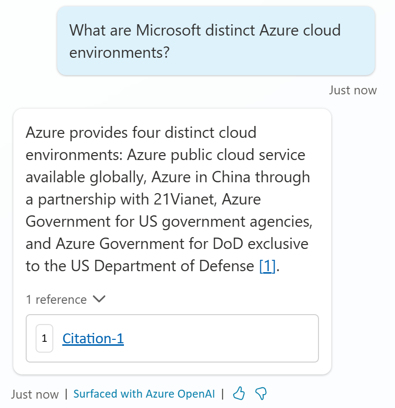

# Task 4: Test the Files knowledge source

1.	Navigate to the **Knowledge** tab of your copilot.

	- For the file you have uploaded, wait for the status to be **Ready**.

	- Click the **refresh** button to get an update on the status.

    >{: . important }
    **Tip**: While the file is indexing, explore and complete the other lab’s data sources and tasks.

1.	Launch the **Test** pane.

1.	Ask a question that doesn’t match an existing topic to trigger the **Conversational boosting** topic.

	**What are Microsoft distinct Azure cloud environments?**

	>{: .important } 
  Notice how the **citation** is rendered differently?

    
