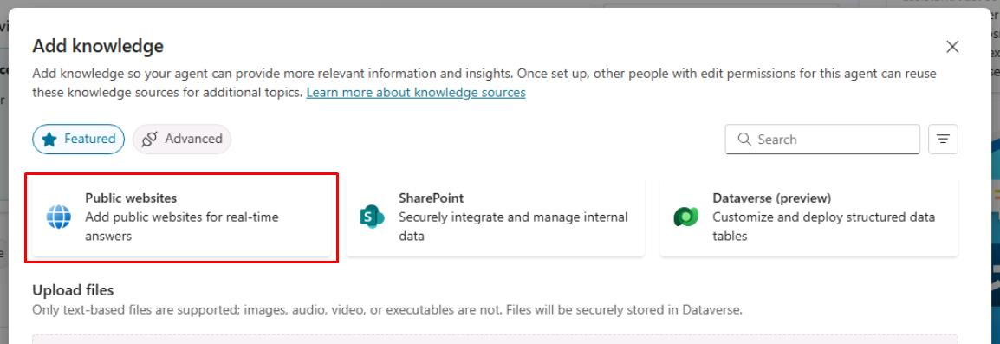
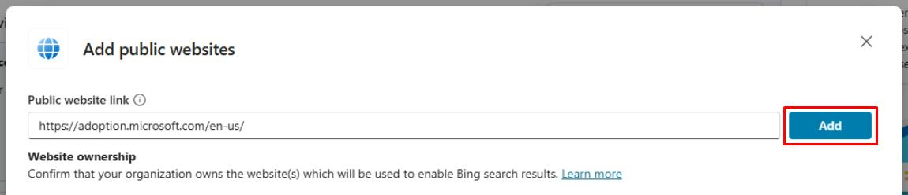
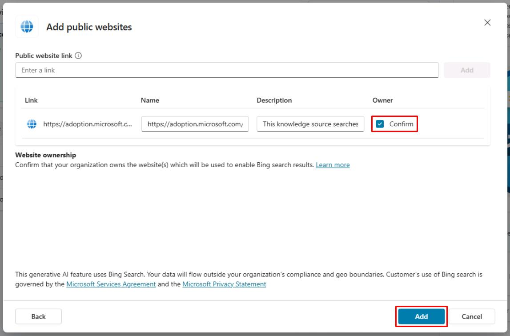

# Task 04: Configure a website knowledge source

## Introduction

To provide additional information to Contoso’s customers, you can integrate a website as a knowledge source.

## Description

In this task, you’ll configure a website knowledge source to allow the agent to access and retrieve information from a specified website. You’ll set up the website URL and configure access permissions.

## Success criteria

-   You successfully configured the website knowledge source with the correct URL and access permissions.

## Key tasks

### 01: Configure a website knowledge source

 
  
<strong>Expand this section to view the solution</strong>
 

1. Select **Add knowledge** again in the upper-left part of the window.

1. Select **Public websites**.

	

1. Enter `https://adoption.microsoft.com/en-us/`, then select **Add**.

	

1. Select the **Confirm** checkbox under the **Owner** column, then select **Add** in the lower-right corner of the pane.

	

	{: .important }
	> Ensure each knowledge source has a meaningful name and explicit description of what it can return.

---

{: . important }
> **Pro tips**:  
>  - When using the default built-in natural language understanding model, knowledge sources are invoked from the **Create generative answers** node. By default, user sentences that don't trigger a topic will go to the **Conversational boosting** topic, where a **Generative answers** node is pre-configured.  
>  - When generative AI orchestration is enabled, the large language model will look at each knowledge source model description to know what data source to use to answer a user query.
 
 
