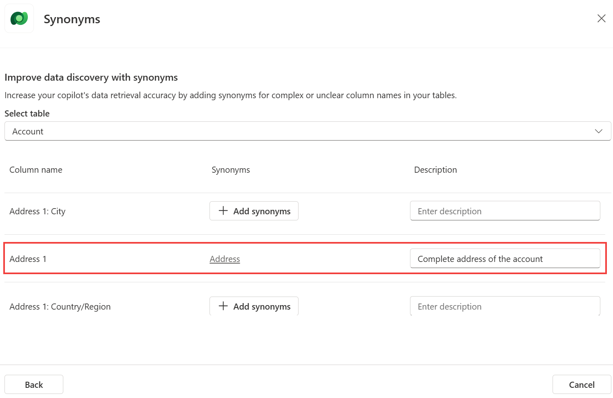
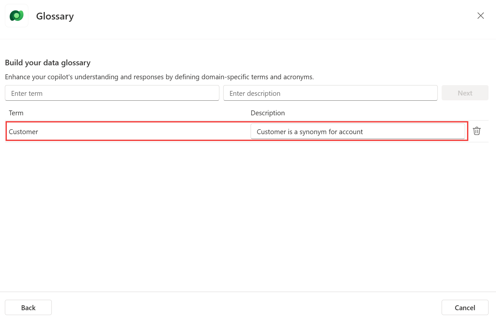

# Task 05: Configuring the Dataverse knowledge source

The Dataverse knowledge source allows users to make natural language queries over structured data, stored in Dataverse tables.

1.	Navigate to the **Knowledge** tab of your copilot and select **Add knowledge**.

2.	Select **Dataverse**, and search **Account** and select the **Account** table and click **Next**.

3.	Check the table contains data, and click **Next**.

4.	To improve the understanding of questions about specific attributes of the table, in **Synonyms**, select **Edit**.

	 - In this example, for **Address 1**, add **Address** as a **Synonym**, with **Complete address of the account** as the **Description**. Then select **Back**.

 	

5.	To improve the understanding of user questions about accounts, in **Glossary**, select **Edit**.

	- In this example, add **Customer** as a **Term**, with **Customer is a synonym for account** as the **Description**. Then select **Next**, then **Back**.

 	

6.	Keep the default values **Knowledge name** and **Knowledge description**.

7.	Click **Add**.

8.	Because **Dataverse** is an internal data source, end-users have to be logged in. So go to **Settings**, **Security**, **Authentication**, choose **Authenticate with Microsoft**, then **Save**.

    {: . important }
    >**Pro tip**: This data source requires authentication because any search is done in the context of the connected end-user. So, only records the end-user has at least read access to are returned and summarized.
