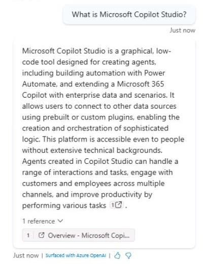

# Task 05: Test website knowledge sources

## Introduction

Contoso, Inc. needs to ensure that their customer service agent can effectively utilize the configured knowledge sources to provide accurate and timely information to their customers, so you will help test the website knowledge source.

## Description

In this task, you’ll test the website knowledge sources configured in Microsoft Copilot Studio to verify that the agent can retrieve information and provide relevant answers to customer queries.

## Success criteria

-   You successfully tested the website knowledge sources in Microsoft Copilot Studio.
-   You verified that the agent can retrieve information from the website knowledge sources and provide relevant answers.
-   You confirmed the accuracy and relevance of the information provided by the agent.


## Key tasks

### 01: Test website knowledge sources

<details markdown="block"> 
  <summary><strong>Expand this section to view the solution</strong></summary> 

1. Select the refresh icon in the upper-right corner of the **Test your agent** pane to start a new conversation.

1. Ask a question that doesn't match an existing topic to trigger the **Conversational boosting** topic:

	```
	What is Microsoft Copilot Studio?
	```

    

	{: .note }
	> Notice there's a citation to ground the answer on, with a link to the source(s) that were used to generate the answer.

1. Ask a follow-up question:

	```
	How do people use it in their business environments?
	```

    {: .note }
	> Although the follow-up question does not mention a specific product, the generative answer maintains context, ensuring the follow-up is interpreted in relation to the previous message.

	{: .note }
	> You'll return to testing the other added knowledge sources later, as they'll take time to be ready for use.
 
</details>

## Custom instructions

Prompt modification allows you to expand the capabilities of generative answers and knowledge sources, by adding custom instructions. When using custom instructions, it's important to follow best practices for prompt engineering. 

Here are some tips to help you get the most out of this feature:

- **Be specific** - Custom instructions should be clear and specific, so the agent knows exactly what to do. Avoid vague or ambiguous language that could lead to confusion or incorrect responses.

- **Use examples** - Provide examples to illustrate your instructions and help the agent understand your expectations. Examples help the agent generate accurate and relevant responses.

- **Keep it simple** - Avoid overloading your custom instructions with too many details or complex logic. Keep your instructions simple and straightforward so the agent can process them effectively.

- **Give the agent an "out"** - Give the agent an alternative path for when it's unable to complete the assigned task. For example, when the user asks a question, you might include "respond with 'not found' if the answer isn't present." This alternative path helps the agent avoid generating false responses.

- **Test and refine** - It's important to test your custom instructions thoroughly to ensure they're working as intended. Adjust as needed to improve the accuracy and effectiveness of your agent's responses.
