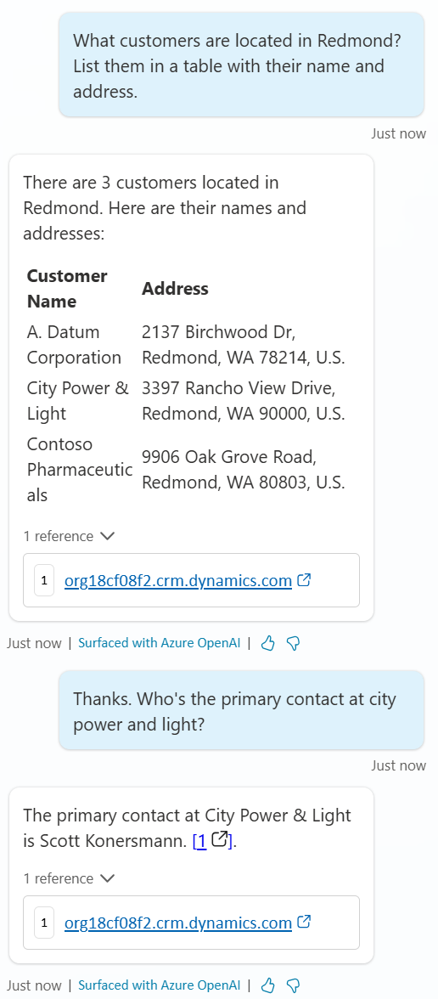

# Task 06: Test the Dataverse knowledge source

1.	Launch the **Test** pane.

2.	**Ask** these 2 below questions, one after the other.

	  >**What customers are located in Redmond? List them in a table with their name and address.**

    >**Thanks. Who's the primary contact at city power and light?**

    
