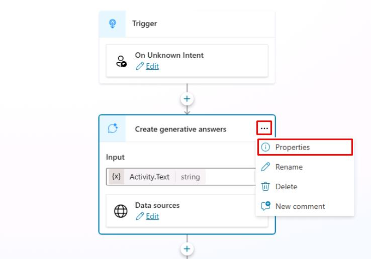

# Task 06: Configure custom instructions for classic orchestration

## Introduction

To customize the behavior of the Contoso customer service agent to better align with their business requirements and customer expectations, you’ll configure custom instructions for classic orchestration.

## Description

In this task, you’ll configure custom instructions for the customer service agent in Microsoft Copilot Studio to modify its responses and behavior based on specific requirements.

## Success criteria

-   You successfully configured custom instructions for the customer service agent in Microsoft Copilot Studio.
-   You verified that the agent's responses and behavior align with the specified requirements.


## Key tasks

### 01: Configure custom instructions for classic orchestration

<details markdown="block"> 
  <summary><strong>Expand this section to view the solution</strong></summary> 

When **Classic** orchestration is enabled for intent recognition, instructions need to be set at the **Create generative answers** node level, typically in the **Conversational boosting** system topic (as this node can be added anywhere).

1. Select **Topics** on the top bar.

1. Select the **System** topics filter near the upper-left corner, then select the **Conversational boosting** topic.

	

1. On the **Create generative answers** node, select the ellipsis in the upper-right corner, then select **Properties**.

	

1. In the text box below the **Content moderation level**, enter the following:

	```
	Talk like a pirate and use pirate expressions.
	Use emojis in your responses.
	Answer in less than 50 words.
	```

    

1. Select **Save** in the upper-right part of the canvas to save the topic.

1. Select the refresh icon in the upper-right corner of the **Test your agent** pane to start a new conversation.

1. Test it by asking a question that doesn't match an existing topic. 

	`What is Microsoft Copilot Studio?`

	

</details>