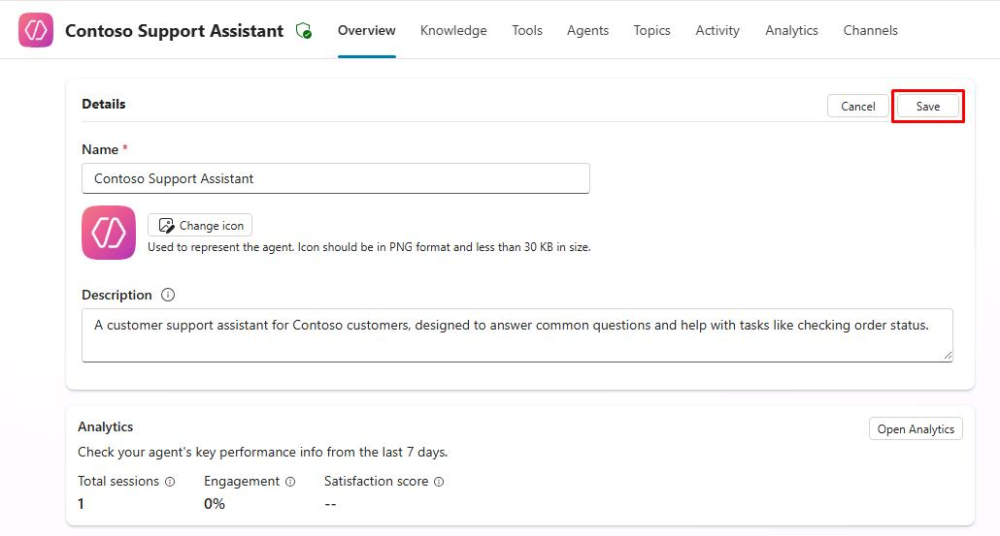

# Task 07: Configure custom instructions for Generative AI Orchestration

## Introduction

Custom instructions can be set in distinct places, depending on whether you use **Generative AI Orchestration** as the main intent recognition mechanism, or if you use the **Classic** natural language understanding approach.

When **Generative AI Orchestration** is enabled, instructions need to be set at the agent level.

Contoso, Inc. can leverage Generative AI Orchestration to enhance the capabilities of their customer service agent.

## Description

In this task, you’ll configure custom instructions for Generative AI Orchestration in Microsoft Copilot Studio to modify the agent's responses and behavior based on specific requirements.

## Success criteria

-   You successfully configured custom instructions for Generative AI Orchestration in Microsoft Copilot Studio.
-   You verified that the agent's responses and behavior align with the specified requirements.


## Key tasks

### 01: Configure custom instructions for Generative AI Orchestration

<details markdown="block"> 
  <summary><strong>Expand this section to view the solution</strong></summary> 

Custom instructions can be set in distinct places, depending on whether you use **Generative AI Orchestration** as the main intent recognition mechanism, or if you use the **Classic** natural language understanding approach.

When **Generative AI Orchestration** is enabled, instructions need to be set at the agent level.

1. Select **Settings** near the upper-right corner of the page.

	

1. Select **Generative AI** on the left settings menu.

1. Under **Use generative AI orchestration for your agent's responses?**, select **Yes**, then select **Save** at the bottom of the page.

	

1. Once successfully saved, select the **X** in the upper-right corner of the **Settings** page.

1. Select **Overview** on the top bar.

	

1. In the upper-right part of the **Details** section, select **Edit**.

	

1. In the upper-right corner of the **Instructions** section, select **Edit**.

    

1. Replace the text in the text box with the following:

	```
	Talk like a pirate and use pirate expressions.
	Use emojis in your responses.
	Answer in less than 50 words.
	```

1. Select **Save** in the upper-right corner of the **Instructions** section.

	

1. Select **Save** in the upper-right corner of the **Details** section.

    

	{: .important }
	> Note that you can also use variables specific to the user content within the instructions.
	>
	> 

</details>