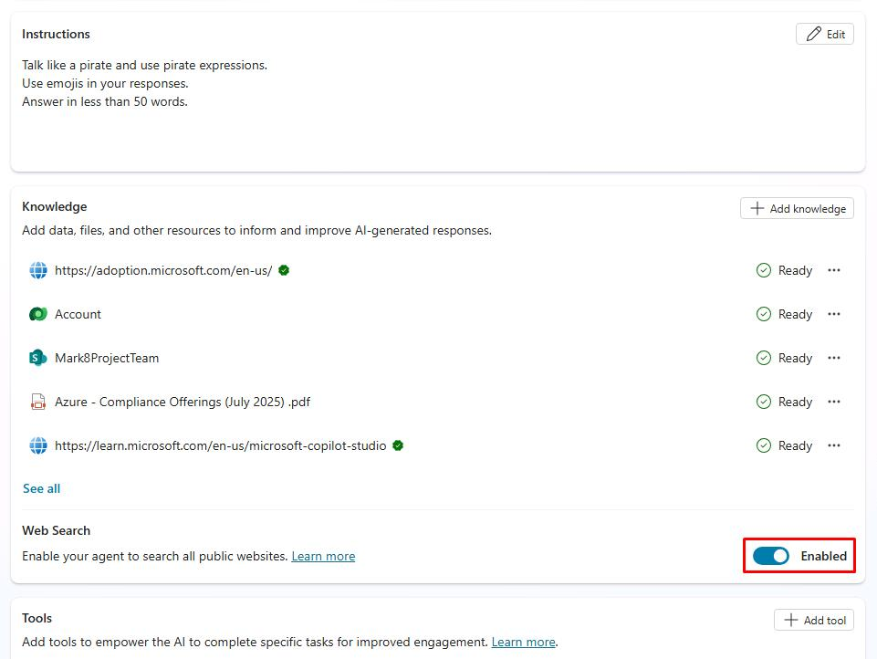
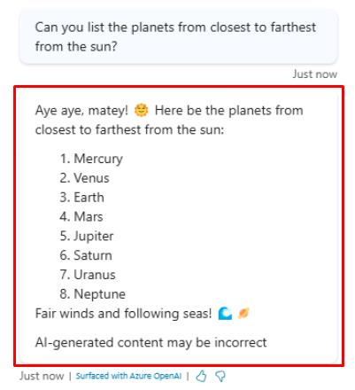

# Task 08: Use AI general knowledge

## Introduction

In addition to knowledge sources, you can use AI general knowledge to allow your agent to find and present information in response to customer questions. General knowledge saves you from needing to manually author multiple topics, which may not address all customer questions.

This capability allows the agent to try and answer questions with its own knowledge, outside of any grounding data from your knowledge sources, like asking questions to ChatGPT.

With the built-in, default, natural language understanding model, any user utterance that does not trigger a topic goes to the **Conversational boosting** topic.

Like any other topic, the logic in the **Conversational boosting** topic can be configured to further meet your scenarios.

Contoso, Inc. can ensure that their customer service agent provides accurate and comprehensive answers to customer queries by leveraging AI general knowledge.

## Description

In this task, you’ll enable and test the AI general knowledge feature in Microsoft Copilot Studio to verify that the agent can provide accurate and comprehensive answers to customer queries.

## Success criteria

-   You successfully enabled the AI general knowledge feature in Microsoft Copilot Studio.
-   You verified that the agent can provide accurate and comprehensive answers to customer queries using AI general knowledge.

## Key tasks

### 01: Use AI general knowledge

 
  
<strong>Expand this section to view the solution</strong>
 

1. On the **Overview** page, move through the page to the **Knowledge** section, then set **Web Search** to **Enabled**.

	

1. Select the refresh icon in the upper-right corner of the **Test your agent** pane to start a new conversation.

1. Ask a question that neither matches an existing or a configured knowledge source.

    `Can you list the planets from closest to farthest from the sun?`

	

