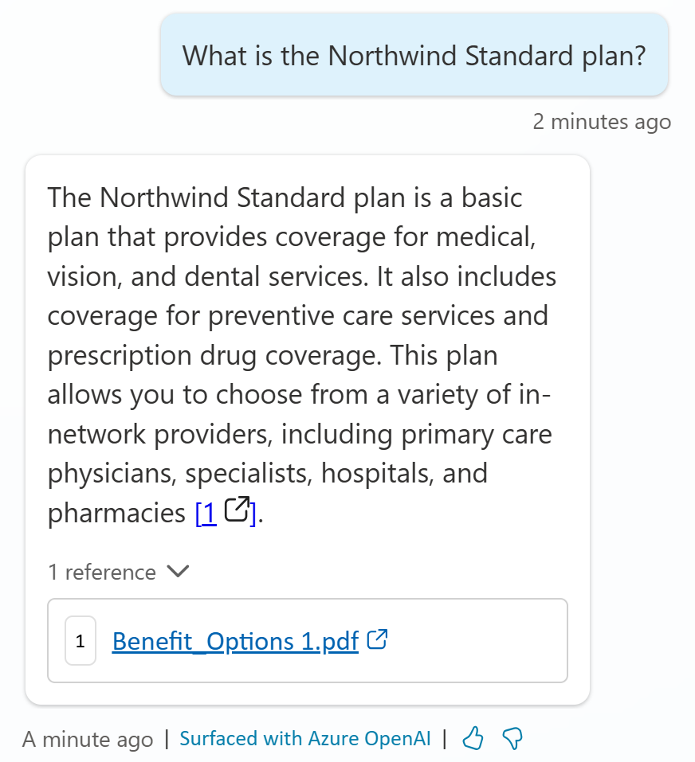

# Task 8: Test the SharePoint knowledge source

1.	Launch the **Test** pane

2.	Ask a question that doesn’t match an existing topic to trigger the **Conversational boosting** topic.

	>**What is the Northwind Standard plan?**

    Notice that it generates an answer and includes citations to ground its answer on and offer the user the option to navigate to the sources that were used to generate this answer

    

## Custom instructions

Prompt modification allows you to expand the capabilities of generative answers and knowledge sources, by adding custom instructions. When using custom instructions, it's important to follow best practices for prompt engineering. 

Here are some tips to help you get the most out of this feature:

•	**Be specific** – Custom instructions should be clear and specific, so the copilot knows exactly what to do. Avoid vague or ambiguous language that could lead to confusion or incorrect responses.

•	**Use examples** – Provide examples to illustrate your instructions and help the copilot understand your expectations. Examples help the copilot generate accurate and relevant responses.

•	**Keep it simple** – Avoid overloading your custom instructions with too many details or complex logic. Keep your instructions simple and straightforward so the copilot can process them effectively.

•	**Give the copilot an “out”** – Give the copilot an alternative path for when it's unable to complete the assigned task. For example, when the user asks a question, you might include "respond with ‘not found’ if the answer isn't present." This alternative path helps the copilot avoid generating false responses.

•	**Test and refine** – It's important to test your custom instructions thoroughly to ensure they're working as intended. Make adjustments as needed to improve the accuracy and effectiveness of your copilot’s responses.
