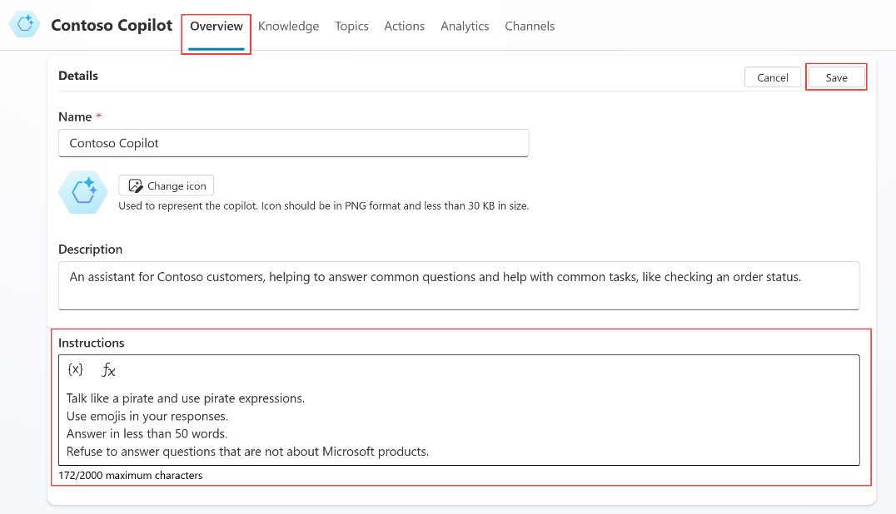

# Task 9: Configure custom instructions for Generative AI Orchestration

**Custom instructions** can be set in distinct places, depending on whether you use **Generative AI Orchestration** as the main intent recognition mechanism, or if you use the **Classic** natural language understanding approach.

When **Generative AI Orchestration** is enabled, instructions need to be set at the **copilot** level.

1.	Let’s first make sure Generative AI orchestration is enabled. From the navigation, go to **Settings** tab.

2.	Navigate to the **Generative AI** menu.

3.	In **How should your copilot decide how to respond?**, select **Generative (preview)**.

4.	**Save** and **Close** the settings.

5.	From the navigation, go to the **Overview** tab.

6.	In the **Details** area, select **Edit**.

7.	Update the Instructions

      {: .important }
      >Notice that you can use variables that are specific to the user context.

      **Talk like a pirate and use pirate expressions. Use emojis in your responses. Answer in less than 50 words. Refuse to answer questions that are not about Microsoft products.**

1.	**Save**

    
