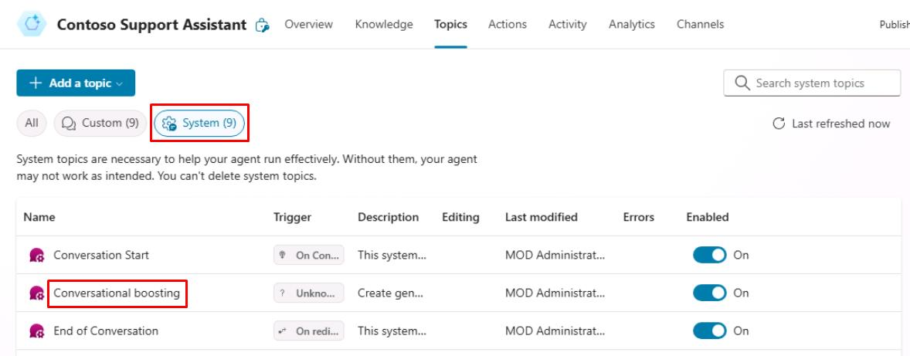
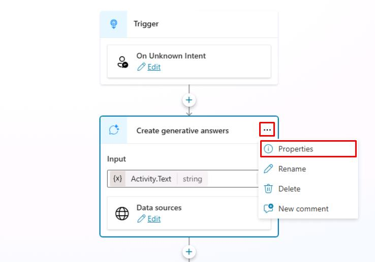
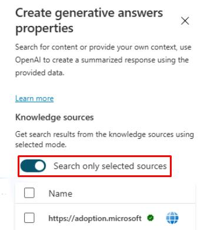
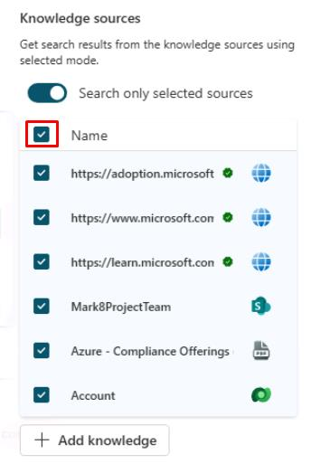
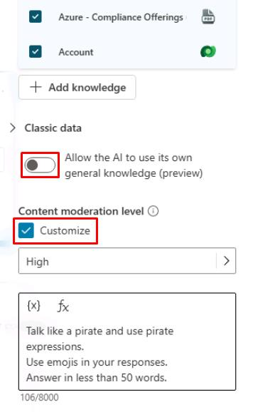
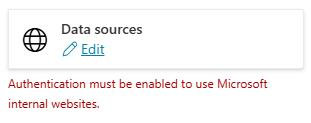

# Task 09: Review the **Generative answers** node

## Introduction

Contoso, Inc. now needs to ensure that their customer service agent can effectively utilize the **Generative answers** node to provide accurate and timely information to their customers.

## Description

In this task, you’ll review the **Generative answers** node in Microsoft Copilot Studio to verify that the agent can retrieve information and provide relevant answers to customer queries.

## Success criteria

-   You successfully reviewed the **Generative answers** node in Microsoft Copilot Studio.
-   You verified that the agent can retrieve information from the **Generative answers** node and provide relevant answers.

## Key tasks

### 01: Review the **Generative answers** node

 
  
<strong>Expand this section to view the solution</strong>
 

1. Select **Topics** on the top bar.

1. Select the **System** topics filter near the upper-left part of the window, then select the **Conversational boosting** topic.

    

1. On the **Create generative answers** node, select the ellipsis in the upper-right corner, then select **Properties**.

    

1. Under **Knowledge sources**, select the toggle on for **Search only selected sources**.

    

    {: .note }
    > With this selected, you can hand pick the knowledge sources that should be used when entering that specific node.

1. Select all knowledge sources by selecting the checkbox next to the **Name** header.

      

1. Under **Classic data**, disable **Allow the AI to use its own general knowledge** by selecting the toggle.

1. Under **Content moderation level**, select the **Customize** checkbox.

    

    {: .important }
    > The **Content moderation** setting is the level of controls you apply to avoid the agent from hallucinating (that is, coming up with a wrong answer to a question by misinterpreting or overinterpreting grounding data).

1. Select **Save** in the upper-right part of the canvas to save the topic.

    {: .warning }
    > Disregard any authentication errors under **Data sources**, as they won't apply to the tests in this lab.
    >
    > 

