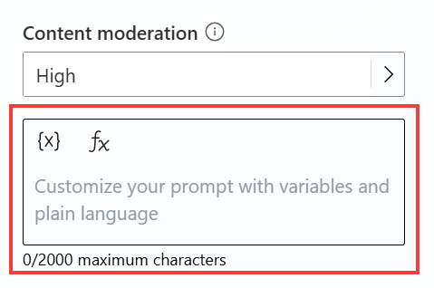

# Task 10: Configure custom instructions for classic orchestration

When **Classic** orchestration is enabled for intent recognition, instructions need to be set at the **Create generative answers** node level, typically in the **Conversational Boosting** system topic (as this node can be added anywhere).

1.	Let’s make sure **Classic** orchestration is enabled. From the navigation, go to **Settings** tab.

2.	Navigate to the **Generative AI** menu.

3.	In **How should your copilot decide how to respond?**, select **Classic**.

4.	**Save** and **Close** the settings.

5.	From the navigation, go to the **Topics** tab.

6.	Select the **System** topics area.

7.	Select the **Conversational boosting** topic.

8.	Go to the **Create generative answers** node **properties**

9.	There is text area where the placeholder text says **Customize your prompt with variables and plain language**. Add your custom instructions here.

    >**Talk like a pirate and use pirate expressions.  Use emojis in your responses.  Answer in less than 50 words.**

    

1.	**Save**
