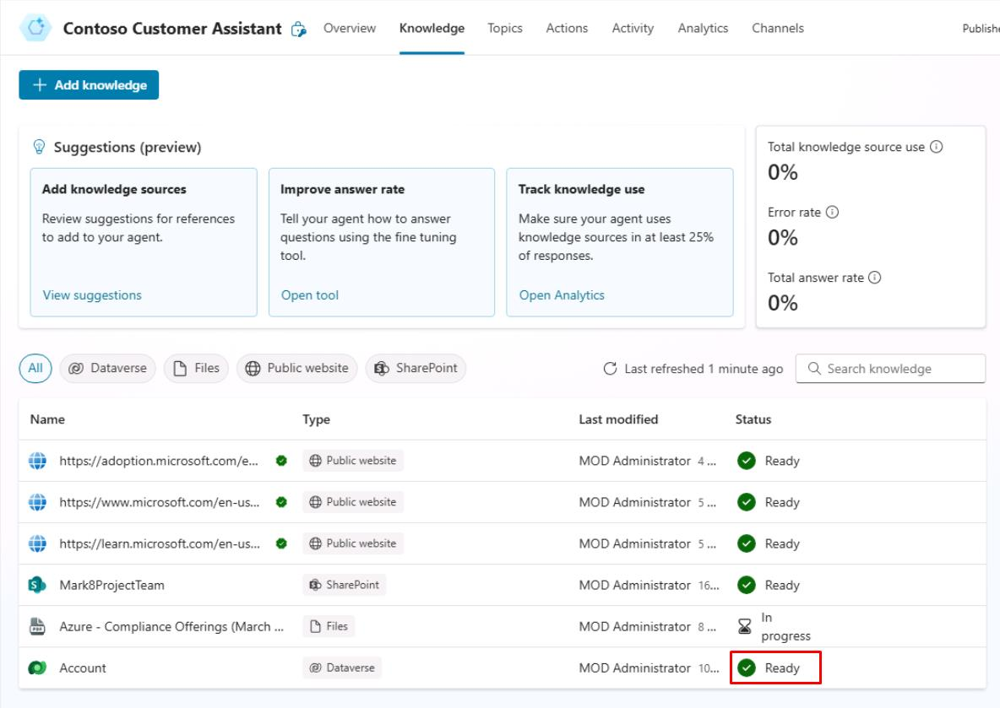
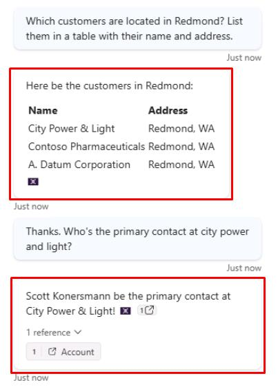

# Task 10: Test the Dataverse knowledge source

## Introduction

Now you’ll help Contoso ensure that their customer service agent can effectively utilize the Dataverse knowledge source to provide accurate information.

## Description

In this task, you’ll test the Dataverse knowledge source configured in Microsoft Copilot Studio to verify that the agent can retrieve structured data and provide relevant answers.

## Success criteria

-   You successfully tested the Dataverse knowledge source in Microsoft Copilot Studio.
-   You verified that the agent can retrieve structured data from the Dataverse knowledge source and provide relevant answers.

## Key tasks

### 01: Test the Dataverse knowledge source

 
  
<strong>Expand this section to view the solution</strong>
 

1. Select **Knowledge** on the top bar.

1. Verify **Dataverse** shows as **Ready** under **Status** before proceeding. 

	

1. Select the refresh icon in the upper-right corner of the **Test your agent** pane to start a new conversation.

1. Ask the following about the accounts in the table:

	`Which customers are located in Redmond? List them in a table with their name and address.`

1. Ask a follow-up:

    `Thanks. Who's the primary contact at city power and light?`

	

    
