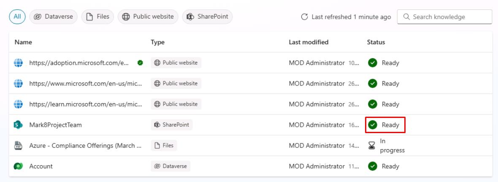
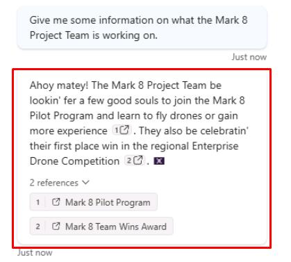

# Task 11: Test the SharePoint knowledge source

## Introduction

Contoso, Inc. also needs to ensure that their customer service agent can use the SharePoint knowledge source.

## Description

In this task, you’ll test the SharePoint knowledge source configured in Microsoft Copilot Studio to verify that the agent can retrieve information and provide relevant answers.

## Success criteria

-   You successfully tested the SharePoint knowledge source in Microsoft Copilot Studio.
-   You verified that the agent can retrieve information from the SharePoint knowledge source and provide relevant answers.

## Key tasks

### 01: Test the SharePoint knowledge source

 
  
<strong>Expand this section to view the solution</strong>
 

1. Select **Knowledge** on the top bar.

	

	{: .note } While the **Status** will show **Ready** for the SharePoint knowledge source, it may take more time to index all of its contents. It should not affect this test, as you'll simply verify it can pull any content.

1. Select the refresh icon in the upper-right corner of the **Test your agent** pane to start a new conversation.

1. Ask a question related to the SharePoint site:

	`Give me some information on what the Mark 8 Project Team is working on.`

	

