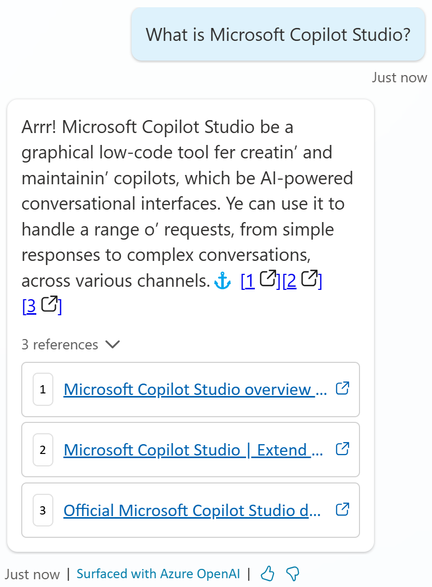

# Task 11: Test custom instructions

1.	Launch the **Test** pane

2.	Ask a question that doesn’t match an existing topic to trigger the **Conversational boosting** topic.

	  >**What is Microsoft Copilot Studio?**

    

## AI general knowledge

In addition to knowledge sources, you can use AI general knowledge to allow your copilot to find and present information in response to your customer's questions. General knowledge saves you from needing to manually author multiple topics, which might not even address all your customer's questions.

This capability allows the copilot to try and answer question with its own knowledge, outside of any grounding data from your knowledge sources. It is similar to asking questions to ChatGPT.
