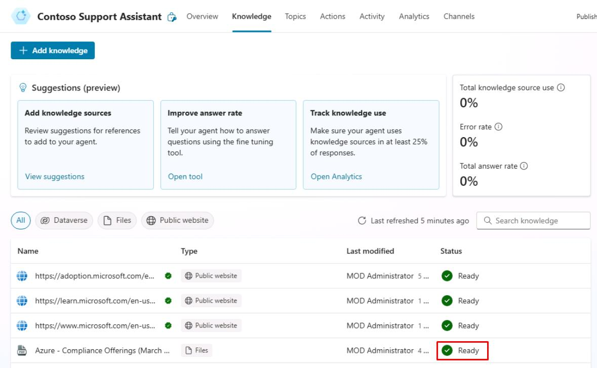
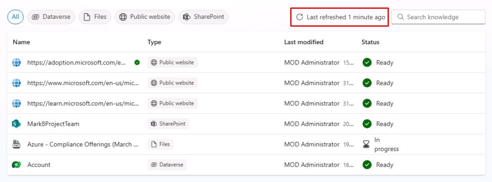
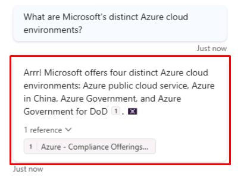

# Task 12: Test the Files knowledge source

## Introduction

Now you can help Contoso test that their customer service agent can effectively utilize the Files knowledge source.

## Description

In this task, you’ll test the Files knowledge source configured in Microsoft Copilot Studio to verify that the agent can retrieve information and provide relevant answers.

## Success criteria

-   You successfully tested the Files knowledge source in Microsoft Copilot Studio.
-   You verified that the agent can retrieve information from the Files knowledge source and provide relevant answers.

## Key tasks

### 01: Test the Files knowledge source

 
  
<strong>Expand this section to view the solution</strong>
 

1. Select **Knowledge** on the top bar.

1. Verify **Azure - Compliance Offerings** shows as **Ready** before proceeding. 

	
	
	{: .warning }
    > This may take around 25 minutes depending on how quickly you moved through these tasks. 
	>
	> This section refreshes automatically at regular intervals, but you can also manually refresh it by selecting the refresh button in the upper-right corner.
	>
	> 

1. Select the refresh icon in the upper-right corner of the **Test your agent** pane to start a new conversation.

1. Ask a question related to the file:

	`What are Microsoft's distinct Azure cloud environments?`

	

	{: .note }
    > Observe how the uploaded PDF is used as a reference in the agent’s response.

---

{: .important } 
> After configuring knowledge sources, you must publish your agent to make it available in Teams:
>
> 1. Download the app package (ZIP file) from Microsoft Copilot Studio. You can find this under **Channels** by selecting the **Download app** option. 
> 1. Open Microsoft Teams and go to the **Apps** section.
> 1. Select **Upload a custom app** and upload the ZIP file.
> 1. Assign the app to the appropriate Teams channel or users.

## Summary

Congratulations on completing Exercise 05!

You’ve learned how to:

-   Make your agent instantly smart by pointing to your website and other knowledge sources.
-   Navigate to the Generative AI settings.
-   Navigate to the Conversational Boosting system topic.
-   Set custom prompt instructions.