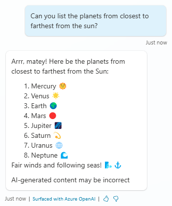

# Task 13: Test the use of AI general knowledge

1.	Launch the **Test** pane.

2.	Ask a question that neither matches an existing or a configured knowledge source.

    >**Can you list the planets from closest to farthest from the sun?**
    >
    

## The conversational boosting topic and the generative answer node

With the built-in, default, natural language understanding model, any user utterance that doesn’t trigger a topic goes to the Conversational boosting topic (and then goes to fallback, if no answer is identified).

Like any other topic, the logic in the Conversational boosting topic can be configured to further meet your scenarios.
