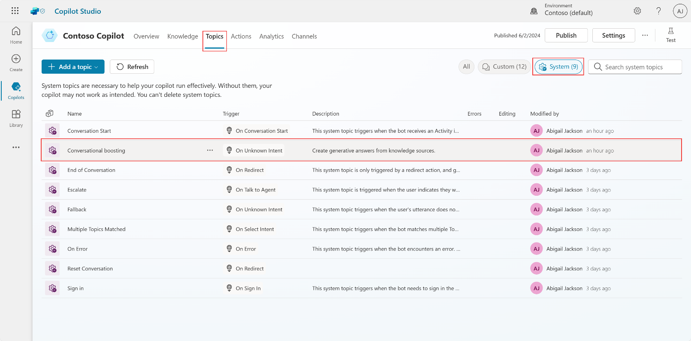

# Task 14: Access the Conversational boosting topic

1.	From the navigation, go to the **Topics** tab.

2.	Select the **System** topics area.

3.	Select the **Conversational boosting** topic.

    
