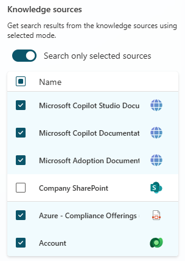
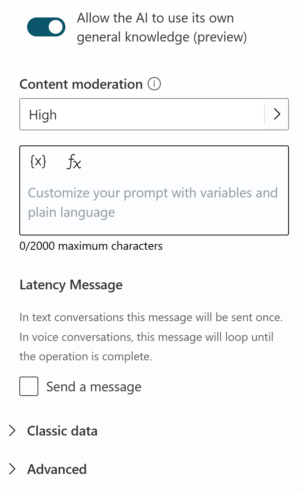
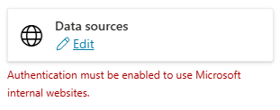

# Task 15: Review the generative answers node

1.	In the **Conversational boosting** topic, go to the **Create generative answers** node **properties**.

1.	With the **Search only selected sources**, see that you hand-pick the **knowledge sources** that should be used when entering that specific node.

1.	For example, select all but the SharePoint knowledge sources (at it’s currently the slowest one).

 	  

1.	You can also choose to **disable AI to use its own general knowledge**, and you can also set **additional custom instructions**. The **Content moderation** setting is the level of controls you apply to avoid the copilot from hallucinating (i.e., coming up with a wrong answer to a question, for example by misinterpreting or overinterpreting grounding data).

    

1.	**Save**.

    >{: . important }
    >**Pro tip**:
    >
    >You may disregard the authentication warning as this won’t apply to the tests done in this lab  
	  >
    >
