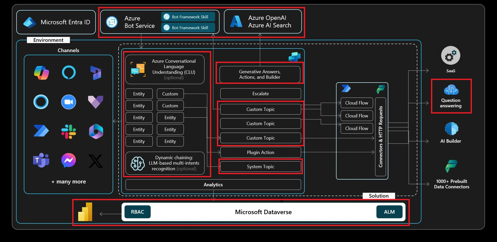

# Exercise 05: Leverage knowledge sources, AI knowledge, and custom instructions

## Goals for this lab

After this lab you will be able to:  
- Make your bot instantly smart by pointing to your website and other knowledge sources. 
- Navigate to the Generative AI settings  
- Navigate to the Conversational Boosting system topic  
- Set custom prompt instructions

## Architecture

## Duration

Estimated time: *30 minutes*.

## Knowledge sources

Knowledge in Microsoft Copilot Studio allows you to add enterprise data from Power Platform, Dynamics 365, and external systems, so your agents can provide relevant information and insights for your end users. In addition, knowledge can be incorporated with generative answers in agents. Published agents that contain knowledge use the configured knowledge sources to ground themselves.

Supported knowledge sources

    <table border="1" cellspacing="0" cellpadding="5">
        <thead>
            <tr>
                <th>Name</th>
                <th>Source</th>
                <th>Description</th>
                <th>Number of inputs supported in general answers</th>
                <th>Authentication</th>
            </tr>
        </thead>
        <tbody>
            <tr>
                <td><strong>Public Website</strong></td>
                <td>External</td>
                <td>Searches the query input on Bing, only returns results from provided websites</td>
                <td>4 public URLs (for example, microsoft.com)</td>
                <td>None</td>
            </tr>
            <tr>
                <td><strong>Documents</strong></td>
                <td>Internal</td>
                <td>Searches documents uploaded to Dataverse, returns results from the document contents</td>
                <td>Limited by Dataverse file storage allocation</td>
                <td>None</td>
            </tr>
            <tr>
                <td><strong>SharePoint</strong></td>
                <td>Internal</td>
                <td>Connects to a SharePoint URL, uses GraphSearch to return results</td>
                <td>4 URLs</td>
                <td>Copilot user's Microsoft Entra ID authentication</td>
            </tr>
            <tr>
                <td><strong>OneDrive for Business</strong></td>
                <td>Internal</td>
                <td>Connects to a OneDrive URL, uses GraphSearch to return results</td>
                <td>4 URLs</td>
                <td>Copilot user's Microsoft Entra ID authentication</td>
            </tr>
            <tr>
                <td><strong>Dataverse</strong></td>
                <td>Internal</td>
                <td>Connects to the connected Dataverse environment and uses retrieval-augmented generative technique</td>
                <td>Two Dataverse knowledge sources (and up to 15 tables per knowledge source)</td>
                <td>Copilot user's Microsoft Entra ID authentication</td>
            </tr>
            <tr>
                <td><strong>Enterprise data via graph connections</strong></td>
                <td>Internal</td>
                <td>Connects to the connected Dataverse environment and uses retrieval-augmented generative technique</td>
                <td>Two per custom copilot</td>
                <td>Copilot user's Microsoft Entra ID authentication</td>
            </tr>
        </tbody>
    </table>

