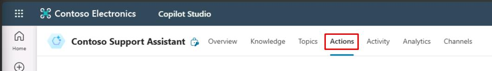
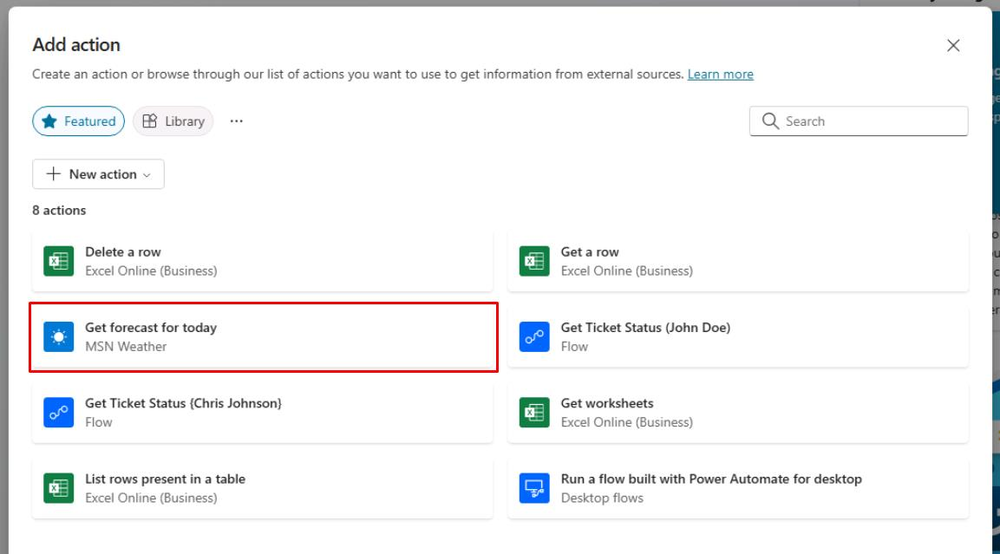
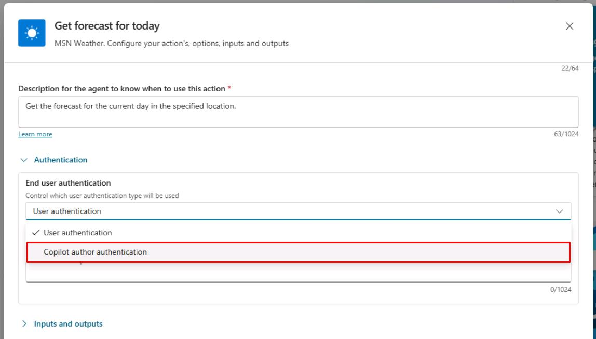
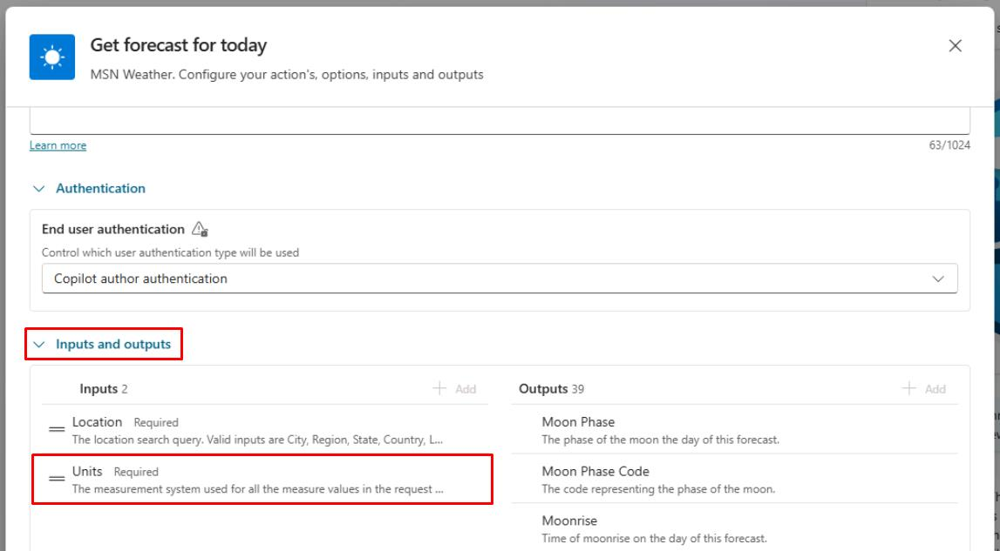
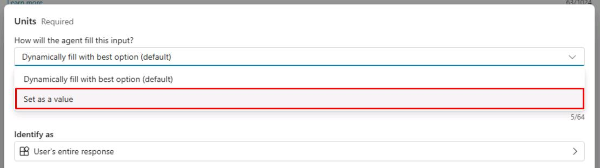
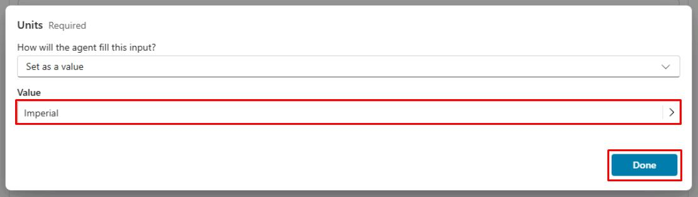
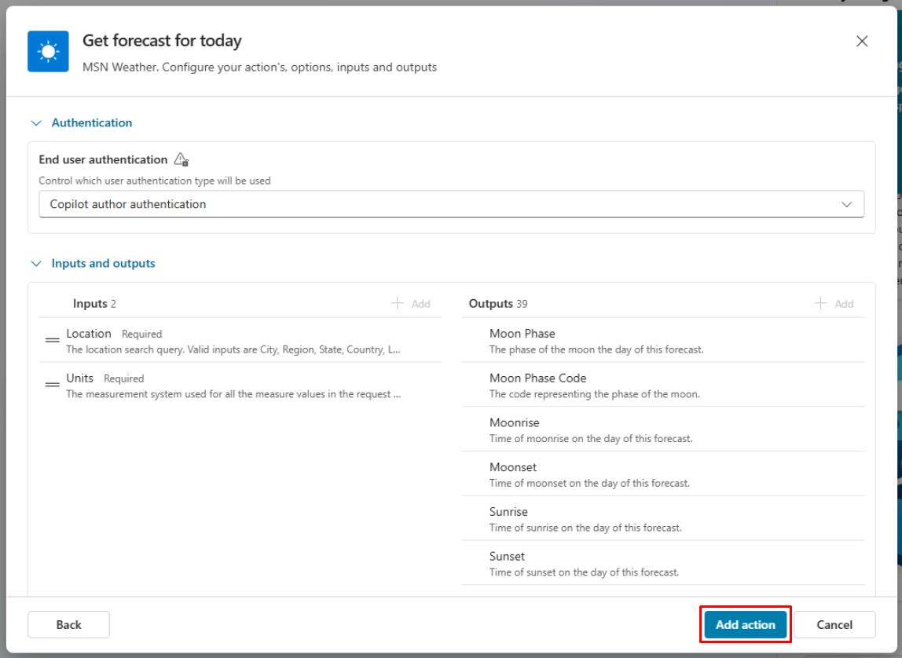

# Task 01: Create an action

## Introduction

Using the configured knowledge sources, Contoso's agent needs to perform actions based on user queries to provide a seamless customer experience. This task involves creating an action using generative AI orchestration.

When you turn on generative mode, your agent can automatically select the most appropriate action or topic to respond to a user at runtime. In classic mode, an agent can only use topics to respond to the user. However, you can still design your agent to call actions explicitly from within topics.

Actions are based on one of the following core action types:

  - Prebuilt connector action
  - Custom connector action
  - Power Automate cloud flow
  - AI Builder prompts
  - Bot Framework skill

Each core action has additional information that describes its purpose, allowing the agent to use generative AI to generate questions. These questions are required to fill in the inputs needed to perform the action. Therefore, you don't need to manually author **Question** nodes to gather all inputs needed, such as the inputs on a flow. Inputs are handled for you during runtime.

Actions can generate a contextual response to a user's query, using the results of the action. Alternatively, you can explicitly author a response for the action.

## Description

In this task, you’ll create an action that allows the agent to interact with external connectors and perform specific tasks. You’ll configure the action and set up the necessary inputs and outputs.

## Success criteria

-   You successfully created an action with the correct inputs and outputs.
-   You verified that the agent can perform the action based on user queries.
-   You tested the action by asking relevant questions.

## Key tasks

### 01: Create an action

 
  
<strong>Expand this section to view the solution</strong>
 

1. Select **Actions** on the top bar.

	

1. Select **Add an action**.

1. Select the **Get forecast for today** MSN Weather connector.

	

1. Select **Next** in the lower-right corner of the pane.

1. Under **End user authentication**, select the dropdown menu, then select **Copilot author authentication**. 

	  

     {: .important }
     > This uses the connector under the context of the agent author, rather than prompting the end user to connect. 

1. Select the **Inputs and outputs** section, then under **Inputs**, select **Units**.

	

1. Select the dropdown menu under **How will the agent fill this input?**, then select **Set as a value**.

	

1. Select **Confirm** on the dialog.

1. Select the text box under **Value**, select **Imperial**, then select **Done** in the lower-right corner of the pane.

	

1. Review the configuration, then select **Add action** in the lower-right corner of the pane.

	

  
