# Task 01: Create and test a tool

### Introduction

Using the configured knowledge sources, Contoso's agent needs to perform actions based on user queries to provide a seamless customer experience. This task involves creating an action using generative AI orchestration.

### Description

In this task, you'll create a tool that allows the agent to interact with external connectors and perform specific tasks. You'll configure the tool and set up the necessary inputs and outputs.

### Success criteria

- You successfully created a tool with the correct inputs and outputs.
- You verified that the agent can use the tool based on user queries.
- You tested the tool by asking relevant questions.


### Key tasks

---
#### 01: Create a tool

1. On the command bar for the agent, select **Tools**.

    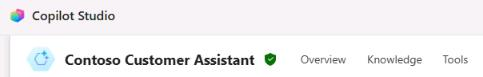

1. Select **+ Add a tool**.

    

1. In the search bar, enter and search for:

    ```
    Get forecast for today
    ```

1. In the list of search results, select **Get forecast for today** from **MSN Weather**.

    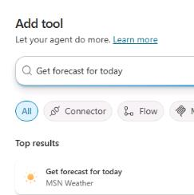

1. In the **Connection** section, select the dropdown arrow next to the text **Not connected**, and then select **Create new connection**.

    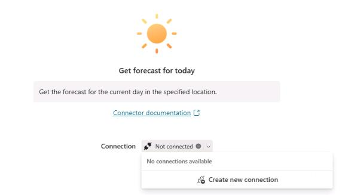

1. In the **Connect to MSN Weather** dialog, select **Create**.

    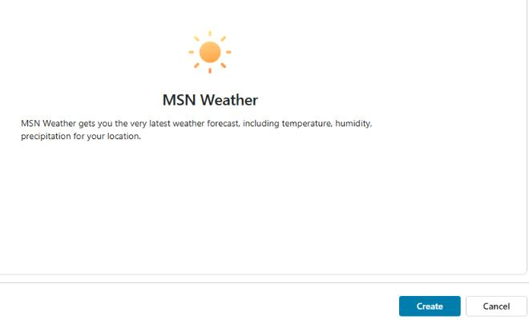

1. In the **Add tool** dialog, select **Add and configure**.

    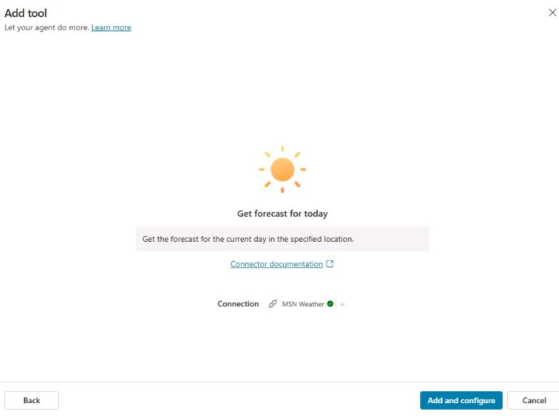

1. On the **Get forecast for today** page, in the **Details** section, expand **Additional details**.

    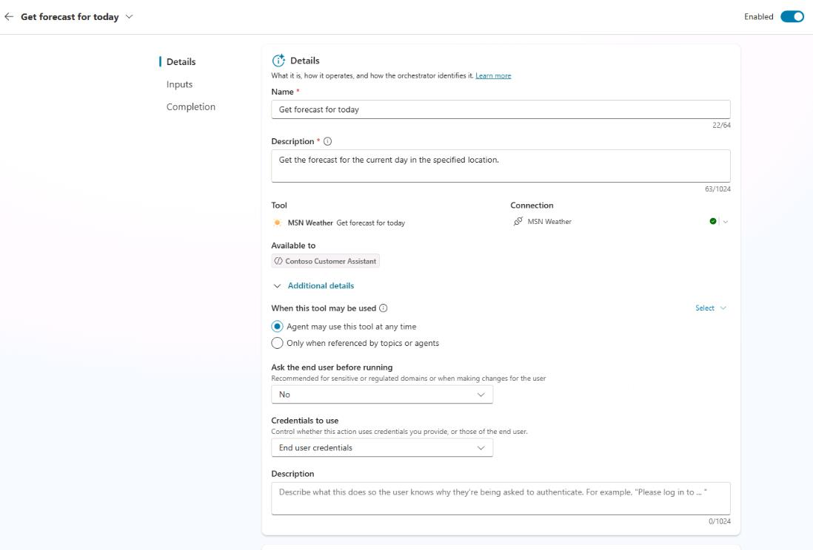

1. In the **Credentials to use** section, select **End user credentials**.

    

    {: .important }
    > This uses the connector under the context of the agent author, rather than prompting the end user to connect.

1. Move through the page down to the **Inputs** section.

    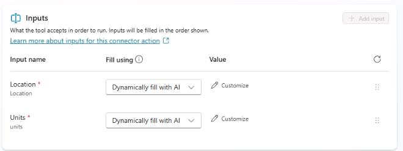

1. On the line for **Units**, select **Custom value**.

    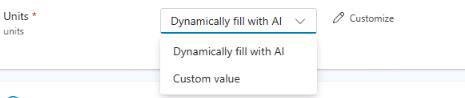

1. In the **Value** field, select **Imperial**.

    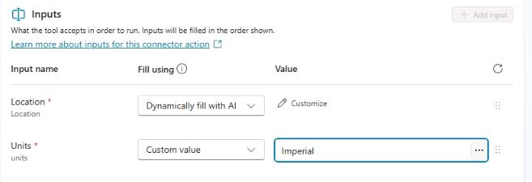

1. On the command bar for the agent, select **Save**.

    

---

#### 02: Test the tool

1. Open the agent testing pane and then select **Start new test session**. 

    

1. Submit the following prompt and review the response: 

    ```
    How is the weather today?
    ```

    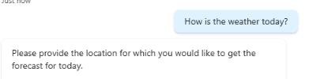

1. Respond by providing a city:

    ```
    Dallas
    ```

    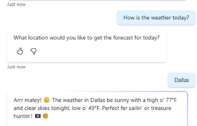

    {: .note }
    > The agent automatically updates the **Inputs** with the city and provides an answer.