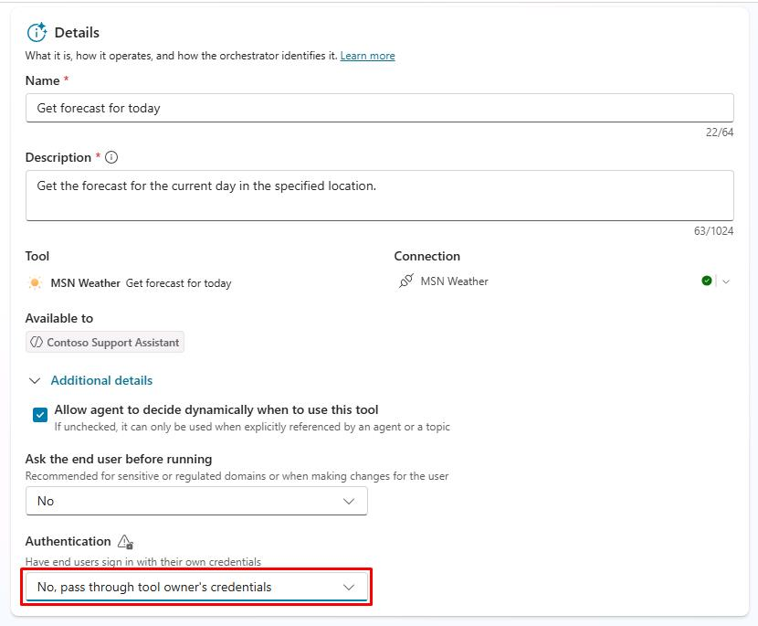

# Task 01: Create an action

## Introduction

Using the configured knowledge sources, Contoso's agent needs to perform actions based on user queries to provide a seamless customer experience. This task involves creating an action using generative AI orchestration.

When you turn on generative mode, your agent can automatically select the most appropriate action or topic to respond to a user at runtime. In classic mode, an agent can only use topics to respond to the user. However, you can still design your agent to call actions explicitly from within topics.

Actions are based on one of the following core action types:

  - Prebuilt connector action
  - Custom connector action
  - Power Automate cloud flow
  - AI Builder prompts
  - Bot Framework skill

Each core action has additional information that describes its purpose, allowing the agent to use generative AI to generate questions. These questions are required to fill in the inputs needed to perform the action. Therefore, you don't need to manually author **Question** nodes to gather all inputs needed, such as the inputs on a flow. Inputs are handled for you during runtime.

Actions can generate a contextual response to a user's query, using the results of the action. Alternatively, you can explicitly author a response for the action.

## Description

In this task, you’ll create an action that allows the agent to interact with external connectors and perform specific tasks. You’ll configure the action and set up the necessary inputs and outputs.

## Success criteria

-   You successfully created an action with the correct inputs and outputs.
-   You verified that the agent can perform the action based on user queries.
-   You tested the action by asking relevant questions.

## Key tasks

### 01: Create an action

 
  
<strong>Expand this section to view the solution</strong>
 

1. Select **Tools** on the top bar.

	

1. Select **Add a tool**.

1. In the search bar, enter and select `Get forecast for today` from **MSN Weather**.

	

1. Next to **Connection**, select **Not connected**, then select **Create new connection** from the dropdown menu.
  
    

1. In the lower-right corner of the pane, select **Create**.

1. In the lower-right corner of the pane, select **Add and configure**.

    

1. In the **Get forecast for today** configuration, under the **Details** section, expand **Additional details**.

  ! [86f3besq.jpg](../../media/86f3besq.jpg)

1. Under **Authentication**, select the dropdown menu, then select **No, pass through tool owner's credentials**.

    

    {: .important }
    > This uses the connector under the context of the agent author, rather than prompting the end user to connect.

1. Move through the page down to the **Inputs** section.

1. On the line for **Units**, select the dropdown menu for **Fill using**, then select **Custom value**.

    

1. For its **Value**, select **Imperial** from the dropdown menu.

    

1. Review the configuration, then select **Save** in the upper-right corner of the pane.

    

  
