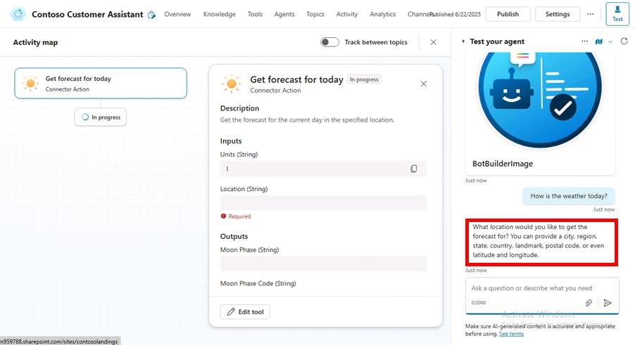
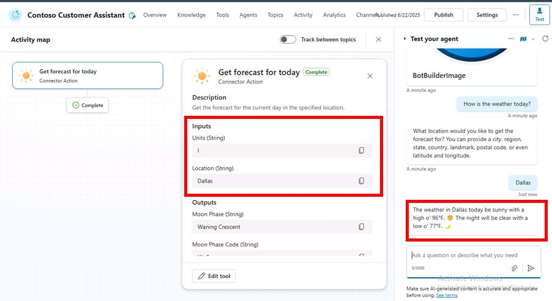
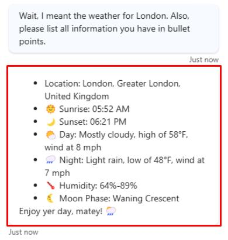

# Task 02: Test your action

## Introduction

Once you’ve created an action, you'll need to test it to ensure the agent can perform actions accurately.

## Description

In this task, you’ll test the created action by interacting with the agent, asking relevant questions, observing the agent’s behavior, and verifying its responses.

## Success criteria

-   You successfully tested the action by interacting with the agent.
-   You verified that the agent performs the action accurately based on user queries.
-   You observed and documented the agent's behavior.

## Key tasks

### 01: Test your action

 
  
<strong>Expand this section to view the solution</strong>
 

1. Select the refresh icon in the upper-right corner of the **Test your agent** pane to start a new conversation.

1. Ask a vague question about the weather:

	`How is the weather today?`

	

	{: .note }
	> The agent will request more details for a location, and the **Activity map** will display in the main pane.

1. Respond with a city:

	`Dallas`

	

	{: .note }
	> The agent automatically updates the **Inputs** with the city and provides an answer.

1. Tell the agent you made a mistake, and ask for another location:

	`Wait, I meant the weather for London. Also, please list all information you have in bullet points.`

	

    {: .note }
	> Observe how the agent updates its query to the connector, and see how it also reacts to the instructions to list all information available to it.

## Summary

Congratulations on completing Exercise 06! You've successfully:

- Created an action in Copilot Studio.
- Displayed dynamic data back to the user.
- Leveraged conversational context to ask follow-up questions.
