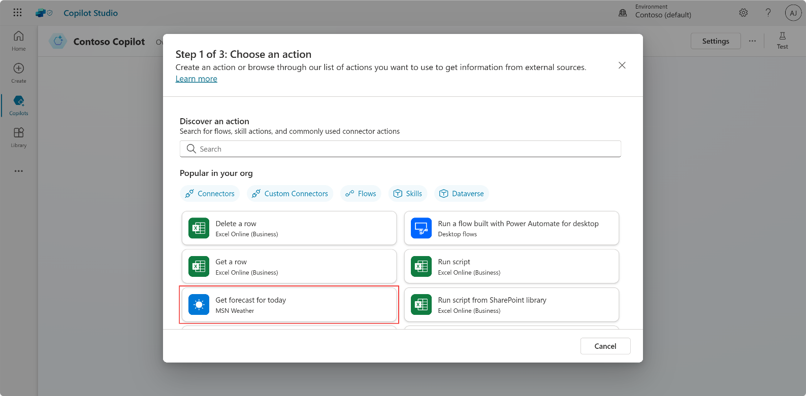
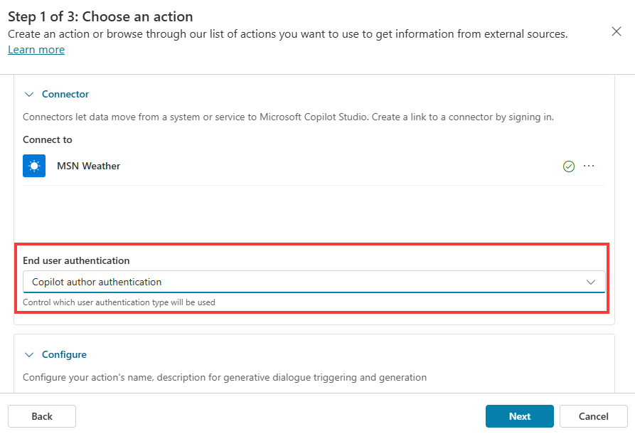

# Task 2: Create an action

1.	From the **navigation**, go to the **Actions** tab

2.	Select **Add an action**.

3.	Select the **Get forecast for today** connector.
 	

4.	Wait for the **connection to get automatically created**.

5.	**Scroll down**, in **End user authentication**, choose **Copilot author authentication**. That way, the copilot can work without using the end-user connection when using the weather connector. Instead, the connection the maker has setup will be used. Leave other properties from that screen as is.
 	

6.	Select **Next**.

7.	Select **Edit inputs**.

8.	Leave the **Location** one as is, but for **Units**, choose **Set as a value**, in **How will the copilot fill this input?**.

9.	Choose the **I** value (Imperial).

10.	**Save**, and then select **Next**.

11.	Review the configuration and select **Finish**.
