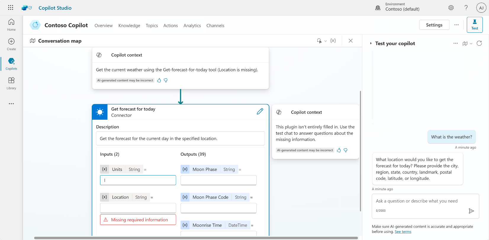
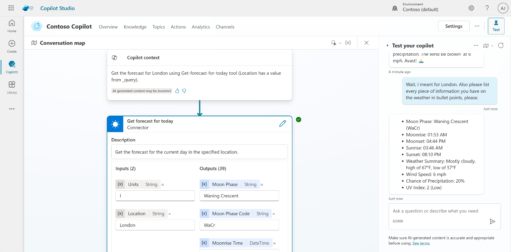

# Task 03: Test your action

1.	Go to the **Test** pane.

2.	Ask a **question**.

	 >**What is the weather?**

1.	In the **Test** pane, click on the **Conversation map** to see how the copilot interprets questions and prompts for answers.
 	

2.	Answer with a city.

	 >**Chicago**

1.	See the copilot **automatically updates the inputs** with the city and provides an answer.

2.	Tell the bot you made a mistake and **change your query**.

	 >**Wait, I meant the weather for London. Also please list every information you have in bullet points, please.**

    

1.	See how the copilot updates its query to the connector, and see how it also reacts to the instruction to list all information available to it.

## Summary

Thank you for completing Exercise 6 ‘Use generative AI orchestration to interact with your connectors’. You have successfully:

  •	Created an action in Copilot Studio

  •	Displayed dynamic data back to the user in Copilot Studio

  •	Leveraged conversational context to ask follow-up questions
