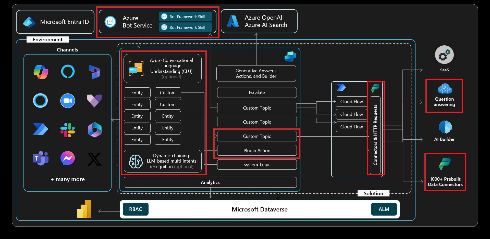

# Exercise 06: Use generative AI orchestration to interact with your connectors

## Scenario

Some customer requests require dynamic actions rather than static answers. Contoso intends to expose line‑of‑business operations (such as creating or updating cases) through plugin actions that the agent can invoke on demand. This exercise shows how to enable generative AI orchestration, let the agent choose the right action at runtime, and test the end‑to‑end flow.

## Objectives

After this exercise you'll be able to:

-   Understand the basics of plugin actions.
-   Use Copilot Studio to request data from another data source using plugin actions, then return the data in a conversational dialog with the end user.

## Architecture

## Duration

Estimated time: *20 minutes*.

## Generative AI orchestration

By default, an agent responds to users by triggering the topic whose trigger phrases match most closely the user's query, and it fills topic inputs from the conversation context. You can configure your agent to use generative AI to choose from topics you created, and actions you added to extend the agent. 
 
In generative mode, an agent can fill topic inputs, not only from the conversation context, but also by generating questions to prompt the user for values. To learn more about this behavior and how to manage it, see [Manage topic inputs and outputs](https://learn.microsoft.com/en-us/microsoft-copilot-studio/advanced-managing-topic-inputs-outputs). 
 
Using generative AI to determine how your agent responds can make the conversation more natural and fluid for the users. When a user sends a message, your agent selects one or more actions or topics to prepare its response. Multiple factors determine the selection. The most important factor is the description of the topics and actions. Other factors include the name of a topic or actions, any input or output parameters, and their names and descriptions. Descriptions make it possible for your agent to be more accurate when it associates a user's intent with actions and topics. 
 
In generative mode, an agent can select multiple actions or topics at once to handle multi-intent queries. Once actions and topics are selected, the agent generates a plan determining their execution order. 
 
When you test an agent that uses generative mode in Copilot Studio, you can open the conversation map to follow the execution of the plan. 