## Task 01: Create and configure a prompt

### Introduction

While generative orchestration is powerful, there are scenarios - such as tightly regulated industries or highly deterministic workflows - where Contoso must disable it and fall back to the classic, topic‑only model. 

### Description

In this task, you'll create a custom prompt that leverages Copilot Studio variables to generate personalized responses. You'll configure the prompt and set up the necessary inputs and outputs.

### Success criteria

- You successfully created a custom prompt with the correct inputs and outputs.
- You verified that the agent can generate personalized responses based on dynamic inputs.
- You tested the prompt by interacting with the agent.


### Key tasks

---
#### 01: Change to classic orchestration

1. On the command bar for the agent, select **Settings**.

	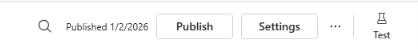

1. In the list of settings, select **Generative AI**.

   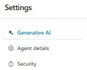

1. In the **Use generative AI orchestration for your agent's responses?** section, select **No** and then select **Save**.

	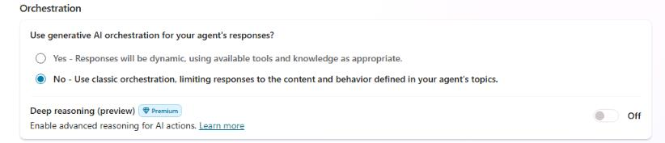

1. Close the **Settings** page.

---

#### 02: Create a prompt
The goal here is to use Generative AI to draft a letter to the user based on the issue raised in the ServiceNow ticket.

1. On the command bar for the agent, select **Topics**.

1. In the list of topics, select **Check Ticket Status**.

	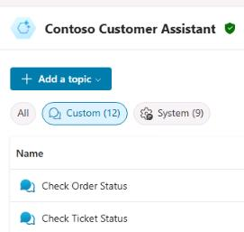

1. Locate the **Message** node. Below the **Message** node, select **+**.

1. Select **Add a tool** and then select **New prompt**.
	
	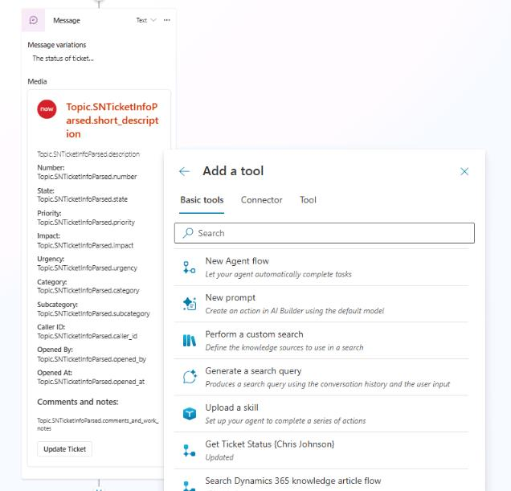
	
1. At the top of the Prompt dialog, change the name from **Custom prompt** to `Ticket customer communication` and then select **Enter**.

	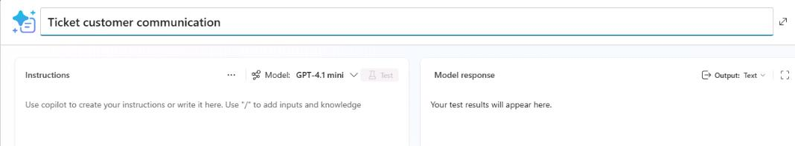

1. In the **Instructions** section, enter the following instructions:

	```
	Based on the ticket details, write a personalized apologetic message to the person impacted. You can summarize the issue to show you understand it. Show empathy and suggest ways to mitigate the situation based on the ticket details. Have a positive attitude and use emojis when applicable. Don't include hashtags. Text should be a single paragraph. Do not use a signature. 
	
	## Ticket Details 
	```

1. Select **Enter** to add a new line below the instructions.

1. Enter `/` to display the menu for adding new input or knowledge, then select **Text** from the dropdown menu.

	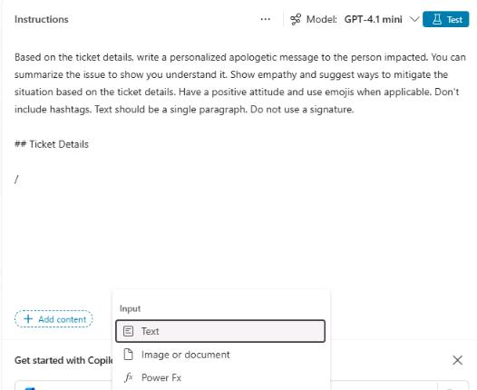

1. In the dialog that displays, in the **Name** field, enter `Ticket Details`.

1. In the **Sample data** field, enter the following JSON code.

	{: .note }
	> This is the same JSON code you used earlier in the lab when you created a simulated connection to ServiceNow.

	```JSON
	{
		"parent": "",
		"made_sla": "true",
		"caused_by": "",
		"watch_list": "",
		"upon_reject": "Cancel all future Tasks",
		"sys_updated_on": "2018-12-12 23:18:55",
		"child_incidents": "0",
		"hold_reason": "",
		"origin_table": "",
		"task_effective_number": "INC0009005",
		"approval_history": "",
		"number": "INC0009005",
		"resolved_by": "",
		"sys_updated_by": "admin",
		"opened_by": "System Administrator",
		"user_input": "",
		"sys_created_on": "2018-08-31 21:35:45",
		"sys_domain": "global",
		"state": "New",
		"route_reason": "",
		"sys_created_by": "admin",
		"knowledge": "false",
		"order": "",
		"calendar_stc": "",
		"closed_at": "",
		"cmdb_ci": "",
		"delivery_plan": "",
		"contract": "",
		"impact": "1 - High",
		"active": "true",
		"work_notes_list": "",
		"business_service": "",
		"business_impact": "",
		"priority": "1 - Critical",
		"sys_domain_path": "/",
		"rfc": "",
		"time_worked": "",
		"expected_start": "",
		"opened_at": "2018-08-31 21:35:21",
		"business_duration": "",
		"group_list": "",
		"work_end": "",
		"caller_id": "David Miller",
		"reopened_time": "",
		"resolved_at": "",
		"approval_set": "",
		"subcategory": "Email",
		"work_notes": "2018-12-12 23:18:42 - System Administrator (Work notes)\nupdated the priority to high based on the criticality of the Incident.\n\n",
		"universal_request": "",
		"short_description": "Email server is down.",
		"correlation_display": "",
		"delivery_task": "",
		"work_start": "",
		"assignment_group": "",
		"additional_assignee_list": "",
		"business_stc": "",
		"cause": "",
		"description": "Unable to send or receive emails.",
		"origin_id": "",
		"calendar_duration": "",
		"close_notes": "",
		"notify": "Do Not Notify",
		"service_offering": "",
		"sys_class_name": "Incident",
		"closed_by": "",
		"follow_up": "",
		"parent_incident": "",
		"sys_id": "ed92e8d173d023002728660c4cf6a7bc",
		"reopened_by": "",
		"incident_state": "New",
		"urgency": "1 - High",
		"problem_id": "",
		"company": "",
		"reassignment_count": "0",
		"activity_due": "2018-12-13 01:18:55",
		"assigned_to": "",
		"severity": "3 - Low",
		"comments": "",
		"approval": "Not Yet Requested",
		"sla_due": "UNKNOWN",
		"comments_and_work_notes": "2018-12-12 23:18:42 - System Administrator (Work notes)\nupdated the priority to high based on the criticality of the Incident.\n\n",
		"due_date": "",
		"sys_mod_count": "3",
		"reopen_count": "0",
		"sys_tags": "",
		"escalation": "Normal",
		"upon_approval": "Proceed to Next Task",
		"correlation_id": "",
		"location": "",
		"category": "Software"
	}
	```
1. Select **Close**.

	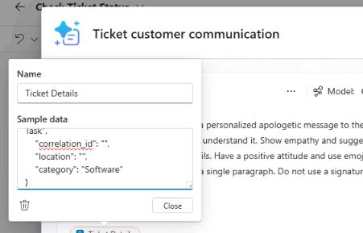

1. In the **Ticket customer communication** dialog, in the **Instructions** section, select the dropdown arrow next to **Model** and then select **Standard GPT-41**.

	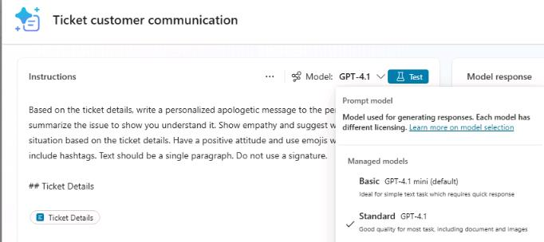

1. Select **Save**. You are returned to the **Check Ticket Status** topic page.


---

#### 03: Configure the **Prompt** and **Message** nodes

1. Locate the **Prompt** node that appears below the **Message** node.

	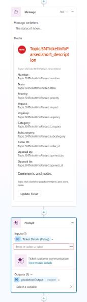

1. In the **Inputs** section, select the ellipsis **(...)** and then select the **SNTicketInfo** variable.

	

1. In the **Outputs** section, select **Select a variable**, then select **Create a new variable**.

	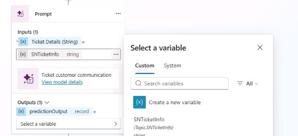

1. Select the **Var1** variable. Then, in the **Variable properties** pane, set **Variable name** to `PersonalizedMessage`.

	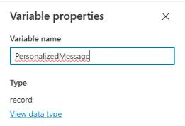

1. Below the **Prompt** node, add a **Message** node.

	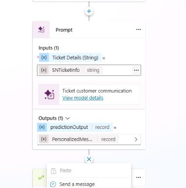

1. In the **Message** node, select **Insert variable** (the **{x}**) icon, then select the **PersonalizedMessage.text** variable.

	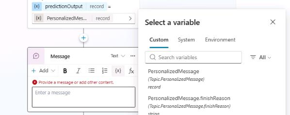

	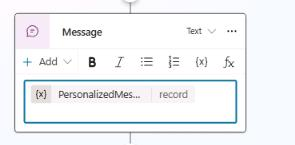

1. On the command bar for the agent, select **Save**.

---

#### 04: Test the changes


1. Open the agent testing pane and then select **Start new test session**. 

	

1. Submit the following prompt and review the response: 

	```
	Hi, could I get an update on ticket INC0007001?
	```

	
	

---

### Congratulations! You've successfully completed the workshop. 
