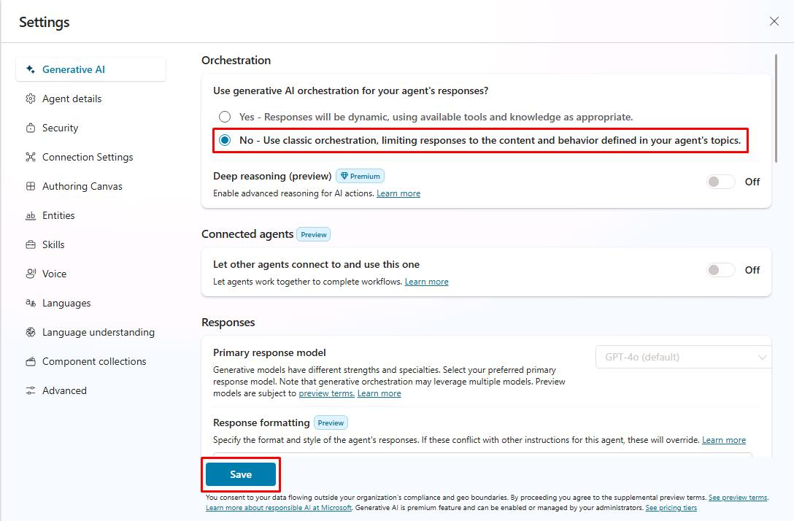

# Task 01: Change to classic orchestration

## Introduction

While generative orchestration is powerful, there are scenarios — such as tightly regulated industries or highly deterministic workflows — where Contoso must disable it and fall back to the classic, topic‑only model. This task walks you through switching the agent to classic orchestration.

## Description

You will open the Generative AI settings pane, change the interaction mode from Generative to Classic, and save the configuration. Afterwards, you’ll verify the change in the agent’s settings and understand how this affects topic triggering and action selection.

## Success criteria

 - The Generative AI setting is set to Classic and saved without errors.
 - The agent no longer displays the Generative badge on the Overview page.
 - Manual tests confirm that only explicit topic triggers are executed; no automatic action runs occur.

## Key tasks

### 01: Change to classic orchestration

 
  
<strong>Expand this section to view the solution</strong>
 

1. Select **Settings** near the upper-right corner of the page.

	

1. Select **Generative AI** on the left settings menu.

1. Under **Use generative AI orchestration for agent's responses?**, select **No**, then select **Save** at the bottom of the page.

	

1. Once successfully saved, select the **X** in the upper-right corner of the **Settings** page.

