# Task 02: Create a prompt

## Introduction

Contoso would like their agent to generate responses based on dynamic inputs, providing personalized customer service. You can support this with AI Builder prompts.

## Description

In this task, you’ll create a custom prompt that leverages Copilot Studio variables to generate personalized responses. You’ll configure the prompt and set up the necessary inputs and outputs.

## Success criteria

-   You successfully created a custom prompt with the correct inputs and outputs.
-   You verified that the agent can generate personalized responses based on dynamic inputs.
-   You tested the prompt by interacting with the agent.


## Key tasks

### 01: Create a prompt

<details markdown="block"> 
  <summary><strong>Expand this section to view the solution</strong></summary> 

1. Select **Topics** on the top bar.

1. Select the **Check Ticket Status** topic.

	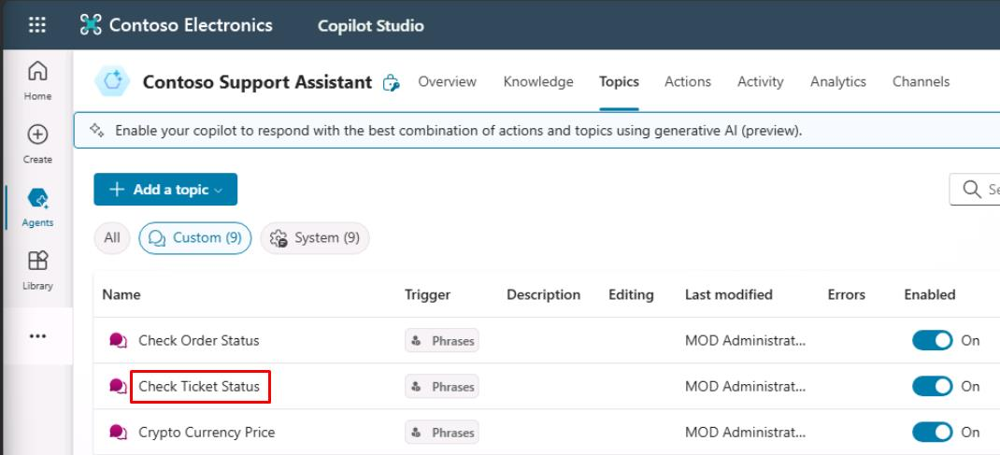

	{: .note }
	> Our goal is to use Generative AI to draft a letter to the user based on the issue raised in the ServiceNow ticket.

1. Below the **Message** node, select the **+** button, select **Add an action**, then select **New prompt**.

	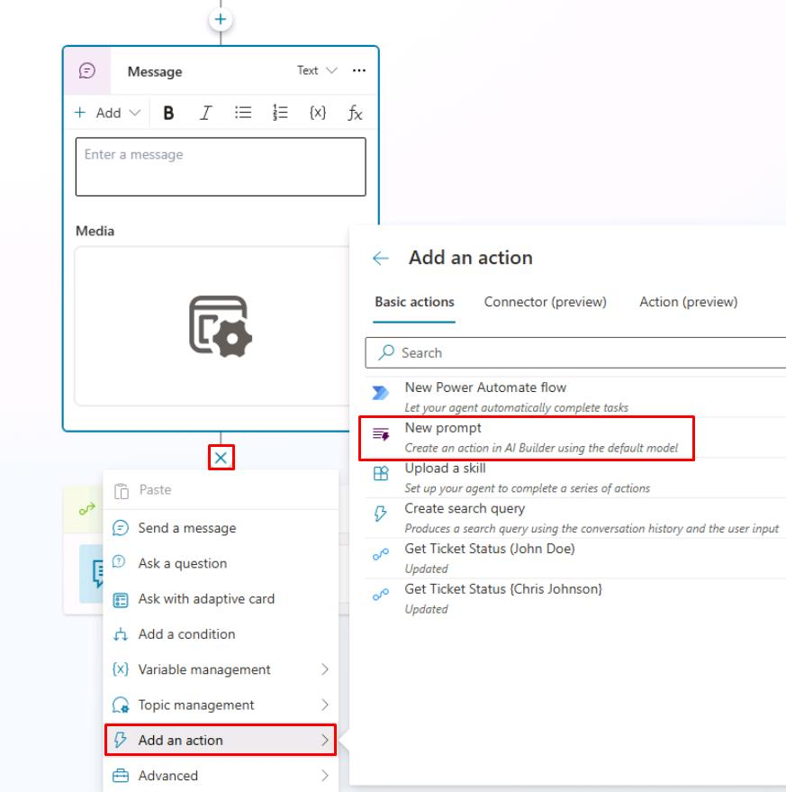

1. For the prompt name, enter `Ticket customer communication`.

	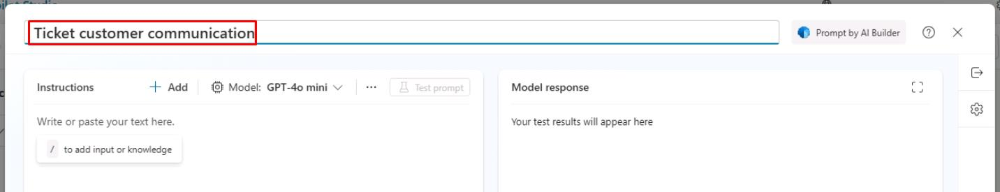

1. In the left **Instructions** section, enter the following instructions: 
 
	``` 
	Based on the ticket details, write a personalized apologetic message to the person impacted. You can summarize the issue to show you understand it. Show empathy and suggest ways to mitigate the situation based on the ticket details. Have a positive attitude and use emojis when applicable. Don't include hashtags. Text should be a single paragraph. Do not use a signature. 
	
	## Ticket Details 
	``` 

1. Select **Enter** to add a new line below the added instructions. 

1. Enter `/` to bring up the menu for adding new input or knowledge, then select **Text** from the dropdown menu.
 
	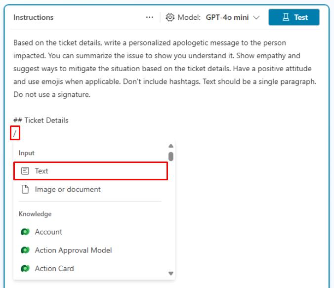
 
1. In the dialog, enter `Ticket Details` for the **Name**. 

1. Under **Sample data**, enter the previously used **ServiceNow Sample JSON Payload**.

	{: .warning }
	> Use the **Copy** option on the following code block and paste it with **Ctrl+V**, rather than use **Type**.

	```json
	{
		"parent": "",
		"made_sla": "true",
		"caused_by": "",
		"watch_list": "",
		"upon_reject": "Cancel all future Tasks",
		"sys_updated_on": "2018-12-12 23:18:55",
		"child_incidents": "0",
		"hold_reason": "",
		"origin_table": "",
		"task_effective_number": "INC0009005",
		"approval_history": "",
		"number": "INC0009005",
		"resolved_by": "",
		"sys_updated_by": "admin",
		"opened_by": "System Administrator",
		"user_input": "",
		"sys_created_on": "2018-08-31 21:35:45",
		"sys_domain": "global",
		"state": "New",
		"route_reason": "",
		"sys_created_by": "admin",
		"knowledge": "false",
		"order": "",
		"calendar_stc": "",
		"closed_at": "",
		"cmdb_ci": "",
		"delivery_plan": "",
		"contract": "",
		"impact": "1 - High",
		"active": "true",
		"work_notes_list": "",
		"business_service": "",
		"business_impact": "",
		"priority": "1 - Critical",
		"sys_domain_path": "/",
		"rfc": "",
		"time_worked": "",
		"expected_start": "",
		"opened_at": "2018-08-31 21:35:21",
		"business_duration": "",
		"group_list": "",
		"work_end": "",
		"caller_id": "David Miller",
		"reopened_time": "",
		"resolved_at": "",
		"approval_set": "",
		"subcategory": "Email",
		"work_notes": "2018-12-12 23:18:42 - System Administrator (Work notes)\nupdated the priority to high based on the criticality of the Incident.\n\n",
		"universal_request": "",
		"short_description": "Email server is down.",
		"correlation_display": "",
		"delivery_task": "",
		"work_start": "",
		"assignment_group": "",
		"additional_assignee_list": "",
		"business_stc": "",
		"cause": "",
		"description": "Unable to send or receive emails.",
		"origin_id": "",
		"calendar_duration": "",
		"close_notes": "",
		"notify": "Do Not Notify",
		"service_offering": "",
		"sys_class_name": "Incident",
		"closed_by": "",
		"follow_up": "",
		"parent_incident": "",
		"sys_id": "ed92e8d173d023002728660c4cf6a7bc",
		"reopened_by": "",
		"incident_state": "New",
		"urgency": "1 - High",
		"problem_id": "",
		"company": "",
		"reassignment_count": "0",
		"activity_due": "2018-12-13 01:18:55",
		"assigned_to": "",
		"severity": "3 - Low",
		"comments": "",
		"approval": "Not Yet Requested",
		"sla_due": "UNKNOWN",
		"comments_and_work_notes": "2018-12-12 23:18:42 - System Administrator (Work notes)\nupdated the priority to high based on the criticality of the Incident.\n\n",
		"due_date": "",
		"sys_mod_count": "3",
		"reopen_count": "0",
		"sys_tags": "",
		"escalation": "Normal",
		"upon_approval": "Proceed to Next Task",
		"correlation_id": "",
		"location": "",
		"category": "Software"
	}
	```

1. Select **Close** in the lower-right corner of the dialog. 
 
	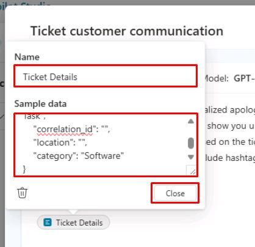

	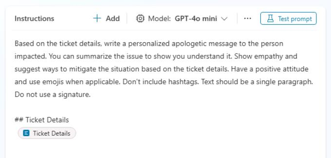
 
1. Select the **Model** dropdown at the top of the **Instructions** section, then select **Standard GPT-4o**. 
 
	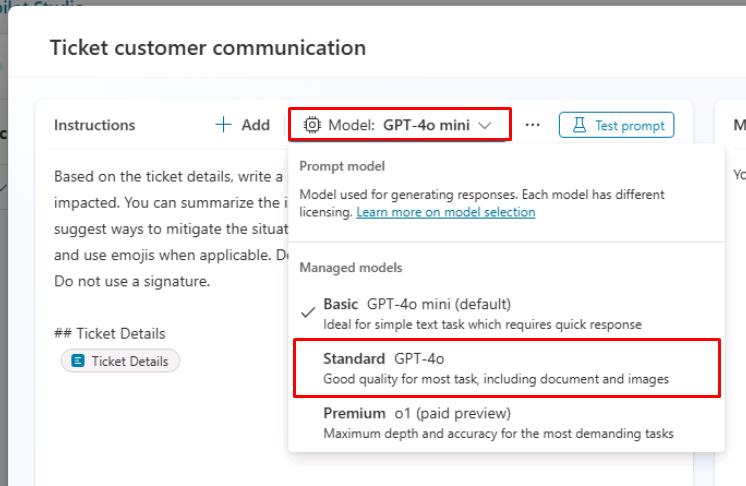
 
1. Select **Save** in the lower-right corner of the prompt pane. 
 
	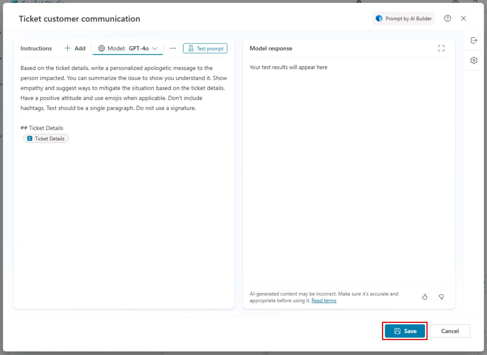


### 02: Configure the **Prompt** and **Message** nodes 

1. In the new **Prompt** node, under **Inputs**, select the chevron **(>)**, then select the **SNTicketInfo** variable.

	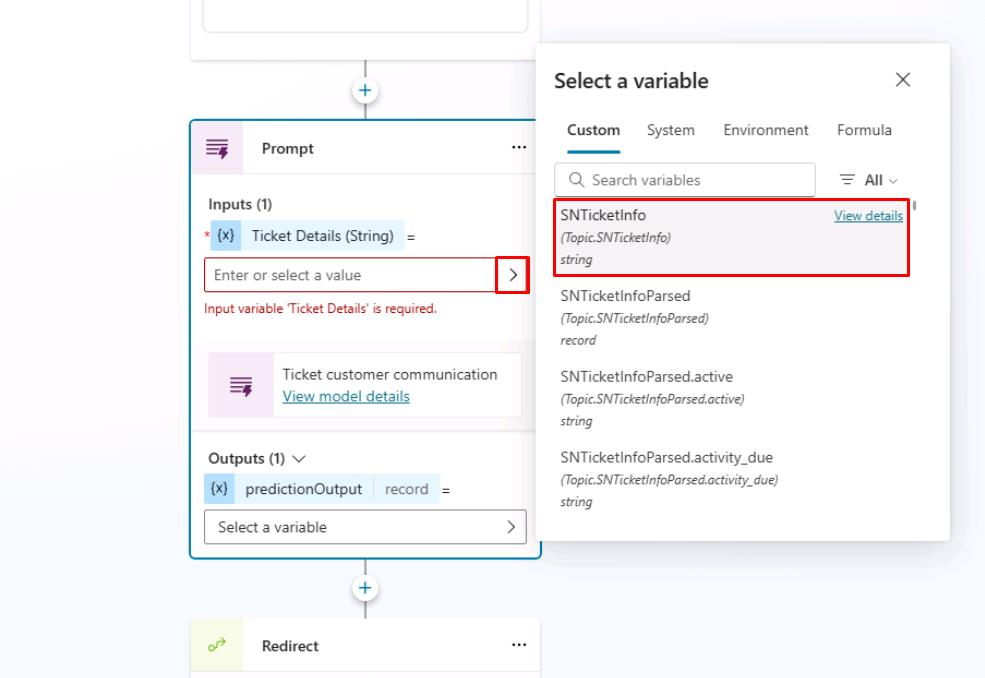

1. Under **Outputs**, select **Select a variable**, then select **Create a new variable**.

	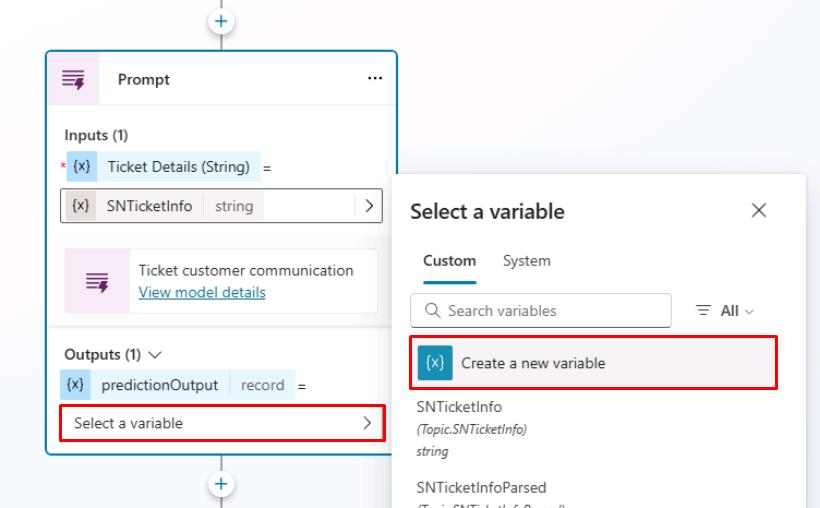

1. Select the **Var1** variable under **Outputs**, then set **Variable name** to `PersonalizedMessage`.

	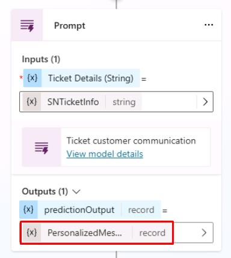

1. Under the **Prompt** node, add a **Message** node.

1. In the **Message** node, select the **{x}** (insert variable) icon, then select the **PersonalizedMessage.text** variable.

	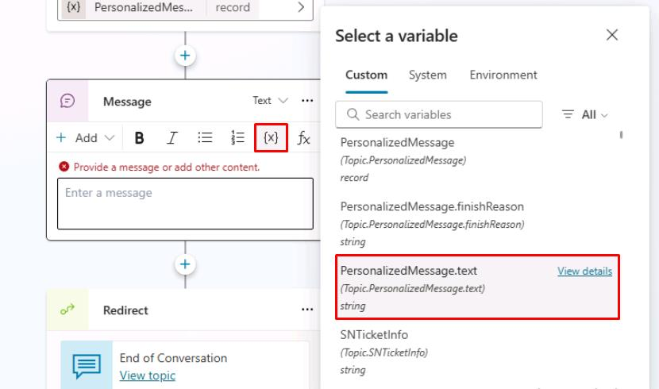

1. Select **Save** in the upper-right part of the canvas to save the topic.

1. Select the refresh icon in the upper-right corner of the **Test your agent** pane to start a new conversation.

1. Test the agent by entering the following prompt: 

	`Hi, could I get an update on ticket INC0007001?`

	


## Summary

Congratulations on completing Exercise 07! You've successfully:

- Created a custom prompt from Copilot Studio.
- Passed it inputs and used its output as a generated answer for the end user.


# Conclusion

**Congratulations!** You've successfully completed this lab!
