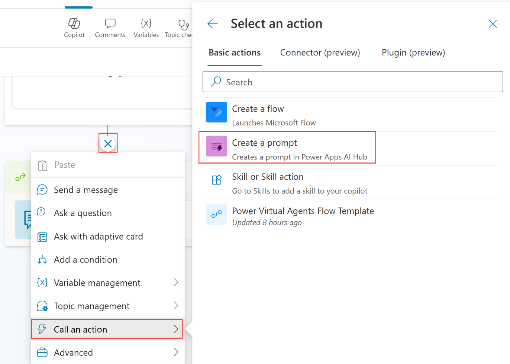
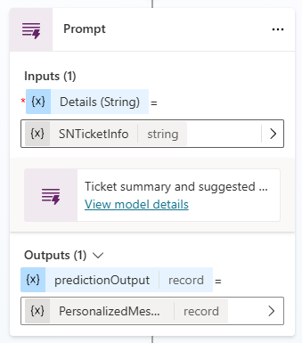
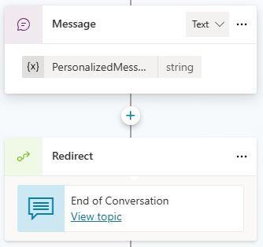
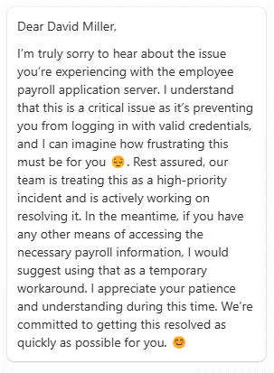

# Task 2: Create a prompt

1. Go to **Topics**, and open **Check Ticket Status**.

	{: .note }
	> Our goal is to use Generative AI to draft a letter to the user based on the issue raised in the ServiceNow ticket

1. After the **last message** that contained an Adaptive Card, add **another node** with the (+) button.

	{: .note }
	> After pressing the (+) button, the + changes to an X as shown. Choose **Call an action** and select **Create a prompt** (view screenshot below).

	

1. Give it a name **Ticket customer communication**.

1. Add an **Input**, called **Ticket Details**. You will find 4 buttons on the right hand side, the top one is the *input* button and it will open the dialog shown below.

1. Test your prompt by pasting the **ServiceNow Sample JSON Payload** from Lab 3 in the input Sample data field and selecting **Test prompt**.

	

1. In the Prompt, paste the below instructions:

   ```
   Based on the ticket details, write a pesonalized apologetic message to the person impacted. You can summarize the issue to show you understand it. Show empathy and suggest ways to mitigate the situation based on the ticket details. Have a positive attitude and use emojis when applicable. Don't include hashtags. Text should be a single paragraph.
   ```
1. Add the text **## Ticket Details** at the bottom of the new text.

1. **Under** the **## Ticket details** section, use the **Insert** button to select the **Details** input.

1. Under **Settings**, choose **Model GPT-4o**.

1. Select **Save custom prompt**.

1. Select the **SNTicketInfo** variable for the **Details input**.

1. Create a variable for the generated output: **PersonalizedMessage**

	

1. Add a **Message** node, and insert the **PersonalizedMessage.text** variable.

	

1. Select **Save**.

1. **Test** by entering the following prompt:

	**What's the latest on ticket INC0007001, please?**

	


## Summary

Thank you for completing Exercise 7 ‘Use generative AI orchestration to interact with your connectors’. 
You have successfully:

•	Created a custom prompt from Copilot Studio

•	Passed it inputs and used its output as a generated answer for the end-user
