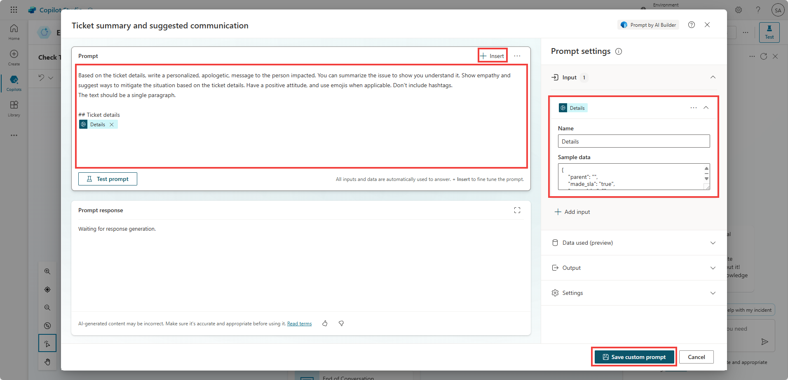

# Task 2: Create a prompt

1.	Go to **Topics**, and open **Check Ticket Status**.

1.	After the **last message** that contained an Adaptive Card, add **another node** with the (+) button.

	   - Choose Call an action and select Create a prompt.

  	

1.	Give it a name **Ticket customer communication**.

1.	Add an **Input**, called **Ticket Details**.

1.	In the Prompt, paste the below instructions:

1.	**Under** the **## Ticket details** section, use the **Insert** button to select the **Details** input.

1.	Under **Settings**, choose **Model GPT-4 (preview)**.

1.	**Test** your prompt by pasting the **ServiceNow Sample JSON Payload** from lab 3 in the input **sample data**, and selecting **Test prompt**.

 	

1.	Select **Save custom prompt**.

1.	Select the **SNTicketInfo** variable for the **Details input**.

1.	Create a variable for the generated output: **PersonalizedMessage**

 	

1.	Add a **Message** node, and insert the **PersonalizedMessage.text** variable.

 	

1.	**Save**.

1.	**Test** by entering the following prompt:

	**What's the latest on ticket INC0007001, please?**

   

## Summary

Thank you for completing Exercise 7 ‘Use generative AI orchestration to interact with your connectors’. 
You have successfully:

•	Created a custom prompt from Copilot Studio

•	Passed it inputs and used its output as a generated answer for the end-user
