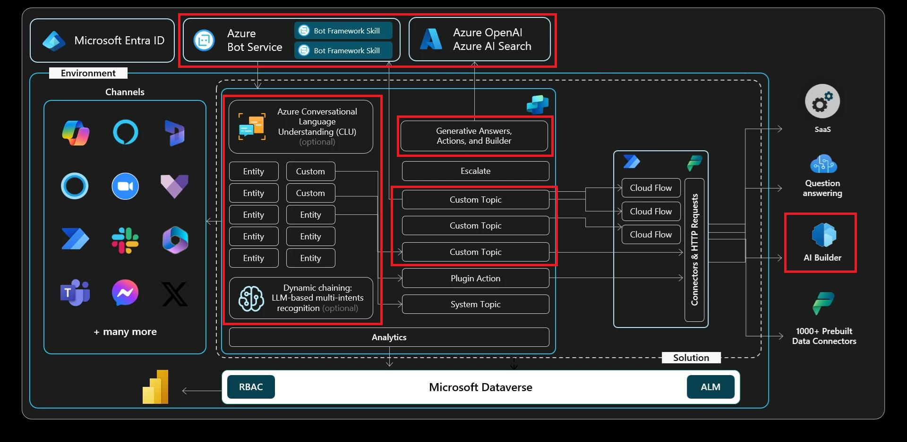

# Exercise 07: Invoke AI Builder prompts

## Scenario

Contoso wants the agent to send personalised follow‑up messages and summaries that go beyond simple data retrieval. AI Builder prompts allow makers to design custom instructions for large‑language‑model output, using variables captured earlier in the conversation. You will create and test a prompt that drafts customer‑ready communications automatically.

## Objectives

After this exercise, you’ll be able to:

-   Understand the basics of AI Builder prompts
-   Invoke a custom prompt that leverages Copilot Studio variables.

## Architecture

## Duration

Estimated time: *25 minutes*.

## AI Builder prompts

AI Builder prompts let you define a task or goal for a large language model (LLM) using natural language. With Prompt Builder, makers can create, test, and reuse custom prompts-complete with dynamic input variables-tailored to specific business needs. 
 
These prompts can be shared and used across Power Automate, Power Apps, and Copilot Studio. For example, you might build a prompt to extract action items from company emails and trigger a workflow in Power Automate. Other use cases include summarizing content, classifying requests, extracting key details, translating responses, assessing sentiment, or drafting replies in the right tone. 
 
Prompts can be integrated into flows to automate tasks or embedded in Copilot Studio agents to deliver context-aware, natural responses at runtime. By carefully designing your instructions, you can control how the model behaves, making AI Builder a powerful and flexible tool for streamlining operations, personalizing experiences, and boosting productivity. 
 