## Task 01: Set up assets  

### Introduction

Contoso has decided to adopt an AI-driven customer support solution to address increasing customer demands and reduce the workload on customer service representatives. To start implementing this solution, you first need to set up the required environment within the Power Platform. This task involves preparing the necessary foundational components such as Dataverse, enabling you to build the AI-powered agent effectively.

### Description

In this task, you'll create an environment and deploy Microsoft Dataverse, sample apps, and data to the environment. 

### Success criteria

- You've navigated to the Power Platform admin center and signed in by using the provided Microsoft 365 credentials.
- You've created an environment, enabled Dataverse, and deployed sample apps and data.


### Key tasks

---

### 01: Configure Power Platform and import an agent

In this task, you'll run a script to recreate the Power Platform environment and import a solution that includes the agent.

{: .note }
> The agent that you import includes all work that you completed in day 1 (exercises 01-04).

1. Sign in to the virtual/local machine.

1. On the taskbar for the virtual/local machine, open the **Windows PowerShell ISE**.

    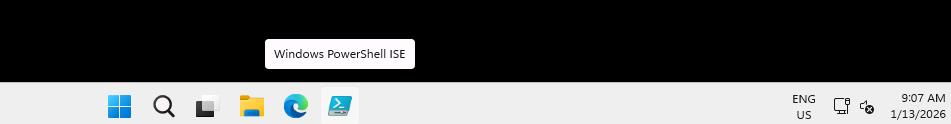

1. In PowerShell ISE, select **File** and then select **New**.

1. In the top pane, enter the following:

    {: .highlight }
    > In the code block that displays below, select **Copy**. Then, In Windows PowerShell ISE, select **Ctrl+V** to paste the code into the editor. 

    ```
    $ErrorActionPreference = "Stop"
    
    # -------------------------
    # Helpers
    # -------------------------
    function Get-EnvIdFromNewEnvObject {
        param([Parameter(Mandatory)] $NewEnv)
    
        # Different module versions may return slightly different property names.
        foreach ($prop in @("EnvironmentName", "Name", "Id")) {
            if ($NewEnv.PSObject.Properties.Name -contains $prop) {
                $val = $NewEnv.$prop
                if (-not [string]::IsNullOrWhiteSpace([string]$val)) {
                    return [string]$val
                }
            }
        }
    
        return $null
    }
    
    function Wait-ForAdminEnvironment {
        param(
            [string]$EnvironmentName,   # GUID string if available
            [Parameter(Mandatory)] [string]$DisplayName,
            [int]$TimeoutSeconds = 600
        )
    
        $deadline = (Get-Date).AddSeconds($TimeoutSeconds)
        $delay = 5
    
        while ((Get-Date) -lt $deadline) {
            try {
                # Prefer the GUID lookup when possible (faster + more reliable).
                if (-not [string]::IsNullOrWhiteSpace($EnvironmentName)) {
                    $env = Get-AdminPowerAppEnvironment -EnvironmentName $EnvironmentName -ErrorAction Stop
                } else {
                    $env = Get-AdminPowerAppEnvironment |
                        Where-Object { $_.DisplayName -eq $DisplayName } |
                        Select-Object -First 1
                }
    
                if ($env) { return $env }
            } catch {
                # Ignore and retry (eventual consistency)
            }
    
            Start-Sleep -Seconds $delay
            if ($delay -lt 30) { $delay = [Math]::Min(30, $delay + 5) }
        }
    
        throw "Timed out waiting for environment '$DisplayName' to appear in Get-AdminPowerAppEnvironment."
    }
    
    function Wait-ForDataverseUrl {
        param(
            [string]$EnvironmentName,
            [Parameter(Mandatory)] [string]$DisplayName,
            [int]$TimeoutSeconds = 900
        )
    
        $deadline = (Get-Date).AddSeconds($TimeoutSeconds)
        $delay = 10
    
        while ((Get-Date) -lt $deadline) {
            $env = Wait-ForAdminEnvironment -EnvironmentName $EnvironmentName -DisplayName $DisplayName -TimeoutSeconds 60
    
            # Try the known URL locations (your original logic)
            $rawUrl = $null
            if ($env.EnvironmentUrl) { $rawUrl = $env.EnvironmentUrl }
            elseif ($env.InstanceApiUrl) { $rawUrl = $env.InstanceApiUrl }
            else {
                try { $rawUrl = $env.Internal.properties.linkedEnvironmentMetadata.instanceApiUrl } catch {}
            }
    
            if (-not [string]::IsNullOrWhiteSpace($rawUrl)) {
                # Normalize: api.crm -> crm
                return ($rawUrl -replace "\.api\.crm", ".crm")
            }
    
            Start-Sleep -Seconds $delay
            if ($delay -lt 60) { $delay = [Math]::Min(60, $delay + 10) }
        }
    
        throw "Timed out waiting for Dataverse URL to be populated for '$DisplayName'."
    }
    
    function Publish-AllCrmCustomizations {
        param([Parameter(Mandatory)] $Conn)
    
        # Different modules expose different publish cmdlets. Prefer the one that exists.
        if (Get-Command -Name Publish-CrmAllCustomization -ErrorAction SilentlyContinue) {
            Publish-CrmAllCustomization -conn $Conn -Verbose
            return
        }
    
        if (Get-Command -Name Publish-CrmAllXml -ErrorAction SilentlyContinue) {
            Publish-CrmAllXml -conn $Conn -Verbose
            return
        }
    
        Write-Warning "No publish cmdlet found (Publish-CrmAllCustomization / Publish-CrmAllXml). Skipping publish step."
    }
    
    # -------------------------
    # Auth (interactive)
    # -------------------------
    Add-PowerAppsAccount
    
    # -------------------------
    # Inputs
    # -------------------------
    $envDisplayName = "Contoso@lab.LabInstance.Id"
    $locationName   = "unitedstates"
    $environmentSku = "Developer"
    $languageCode   = 1033
    $currencyName   = "USD"
    $region         = "eastus"
    $solutionPath   = "F:\LabFiles\Solution\TechExcel_1_0_0_1.zip"
    
    # -------------------------
    # Create environment
    # -------------------------
    $newEnv = New-AdminPowerAppEnvironment `
        -DisplayName        $envDisplayName `
        -LocationName       $locationName `
        -RegionName         $region `
        -EnvironmentSku     $environmentSku `
        -ProvisionDatabase `
        -LanguageName       $languageCode `
        -CurrencyName       $currencyName `
        -WaitUntilFinished  $true
    
    Write-Host "Environment '$envDisplayName' created (provisioning finished)." -ForegroundColor Green
    
    # Capture the GUID if the object includes it (best case)
    $envId = Get-EnvIdFromNewEnvObject -NewEnv $newEnv
    
    # -------------------------
    # Wait for env + URL to be ready
    # -------------------------
    Write-Host "Waiting for environment to be discoverable in admin listings..."
    $targetEnv = Wait-ForAdminEnvironment -EnvironmentName $envId -DisplayName $envDisplayName -TimeoutSeconds 1200
    
    # If we did not get envId from the create response, pull it now from the discovered env
    if ([string]::IsNullOrWhiteSpace($envId)) {
        $envId = $targetEnv.EnvironmentName
    }
    
    Write-Host "Waiting for Dataverse URL to be ready..."
    $cleanUrl = Wait-ForDataverseUrl -EnvironmentName $envId -DisplayName $envDisplayName -TimeoutSeconds 2700
    Write-Host "Target Environment URL: $cleanUrl" -ForegroundColor Cyan
    
    # -------------------------
    # Connect to Dataverse + import
    # -------------------------
    Write-Host "Connecting to Dataverse..."
    $connStr = "AuthType=Office365;Url=$cleanUrl;RequireNewInstance=True"
    $conn = Get-CrmConnection -ConnectionString $connStr -ErrorAction Stop
    
    if (-not $conn.IsReady) {
        throw "Failed to connect. Error: $($conn.LastCrmError)"
    }
    
    Write-Host "Connected successfully. Starting import..."
    try {
        Import-CrmSolution `
            -conn $conn `
            -SolutionFilePath $solutionPath `
            -OverwriteUnmanagedCustomizations $true `
            -Verbose
    
        Write-Host "SUCCESS: Solution imported." -ForegroundColor Green
    } catch {
        throw "IMPORT FAILED: $($_.Exception.Message)"
    }
    
    # -------------------------
    # Publish 
    # -------------------------
    try {
        Write-Host "Publishing all customizations..."
        Publish-AllCrmCustomizations -Conn $conn
        Write-Host "SUCCESS: Publish completed." -ForegroundColor Green
    } catch {
        Write-Warning "Publish failed, but import succeeded. Error: $($_.Exception.Message)"
    } 
    ```

1. After pasting the code into the editor, move to the bottom of the code segment and press the **Enter** key.

    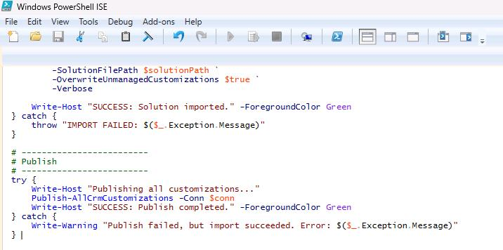

1. The code may start running right away. If it does not, on the Windows PowerShell ISE toolbar, select **Run Script**. 
    
    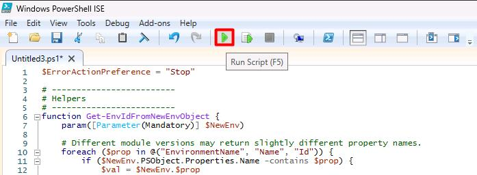

    {: .note }
    > At the bottom left of the Windows PowerShell ISE window, a message will display if the code is running.
    >
    > 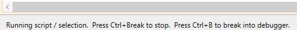

1. The code requires interactive authentication. In the **Sign in** dialog that displays, sign in with the following credentials:

    | Item     | Value   |
    |:---------|:---------|
    | Username | `@lab.CloudPortalCredential(User1).Username`   |
    | Temporary Access Pass (TAP) token | `@lab.CloudPortalCredential(User1).AccessToken` |

1. Wait until the script completes, checking the output in the bottom pane. 

    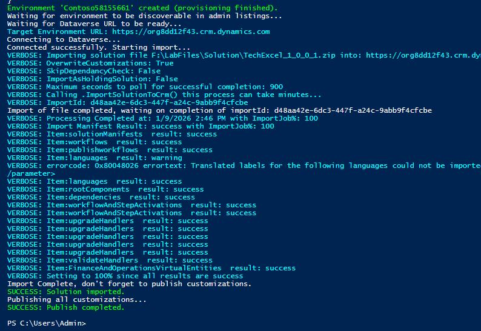

    {: .note }
    > During testing, we observed completion times of 1-5 minutes.

1. Close the PowerShell ISE window.

---

### 02: Configure SharePoint
Next, you'll set up a SharePoint site and upload documents to the site. The agent that you create will use the documents as an authoritative source of information.

{: .note }
> You completed this task in Exercise 01. However, due to recent changes in permissions required to programmatically create SharePoint sites and upload files to document libraries, it is difficult to automate this task.

1. Open a new browser tab and go to ```lodsprodmslearnmca.sharepoint.com/_layouts/15/sharepoint.aspx```.

1. If prompted, sign in by using the following credentials:

    | Item | Value |
    | ---- | ----- |
    | Username | `@lab.CloudPortalCredential(User1).Username` |
    | Temporary Access Pass (TAP) token | `@lab.CloudPortalCredential(User1).AccessToken` |

1. On the command bar, select **Create site**.

    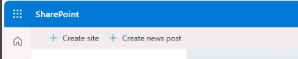

1. In the **Create a site: Select the site type** dialog, select **Communication site**.

    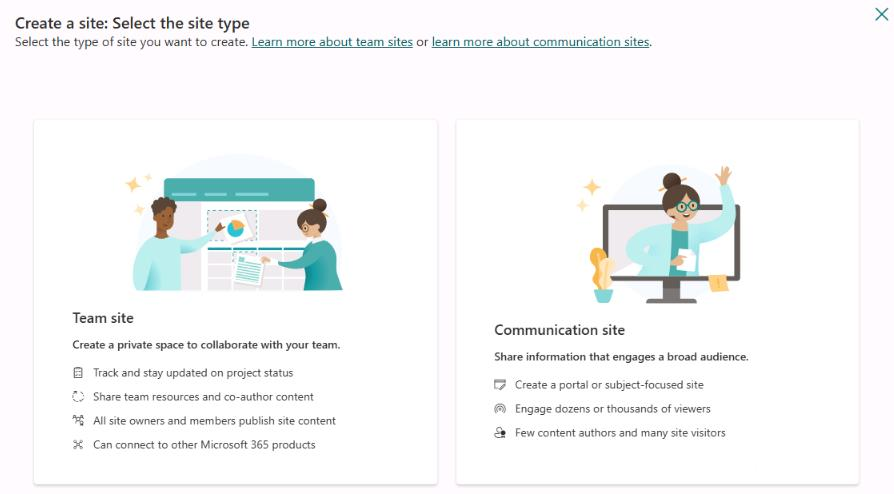

1. In the Select a Template dialog, select **Standard communication**.

    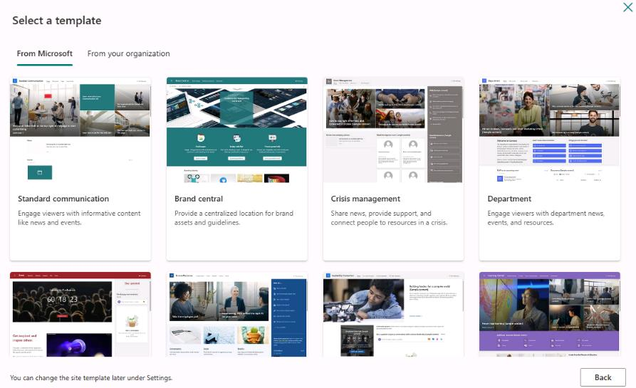

1. In the **Preview and use...** dialog, select **Use template**.

1. In the **Give your site a name** dialog, enter the following details and then select **Next**.

    | Item | Value |
    | ---- | ----- |
    | Site name | `Mark 8 Project Team` |
    | Site description | `The team dedicated to the Mark 8 Project.` |
    | Site address | `Mark8ProjectTeam@lab.LabInstance.Id` |

1. Select **Create site**.

    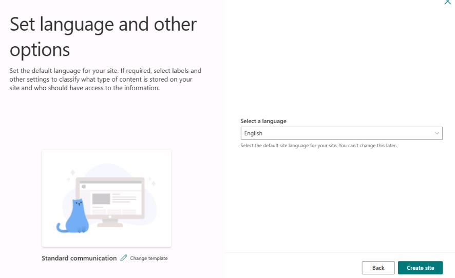

1. On the command bar for the site, select **Documents**.

    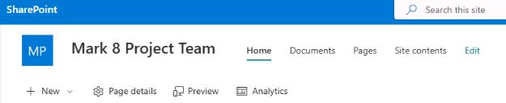

1. On the **Documents** page, on the command bar, select **Upload** and then select **Folder**.

    

1. Go to `F:\LabFiles`, select **SharePointFiles**, and then select **Upload**.

    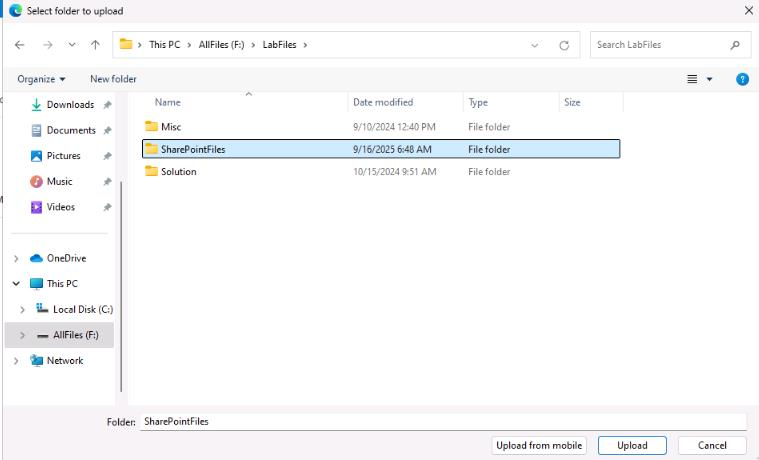

1. In the confirmation dialog that displays, select **Upload**.

    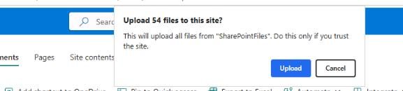

1. After the upload completes, close the SharePoint browser window.

    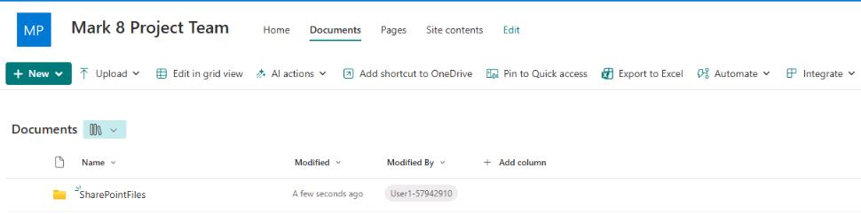

{: .warning }
> Lab activities for "test out" version of lab are in progress. Please disregard **Score** button for now.
